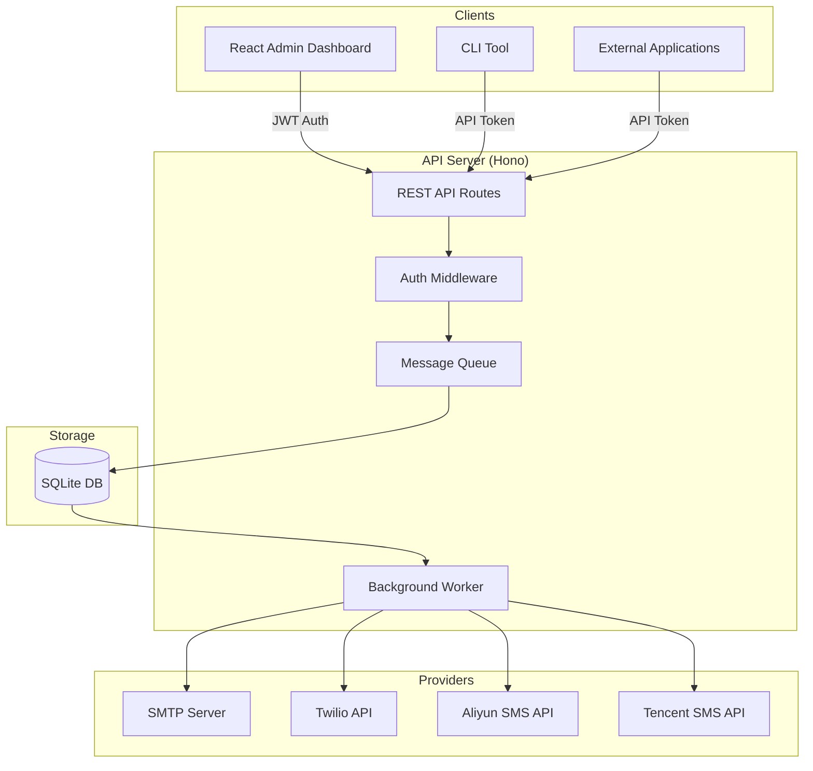
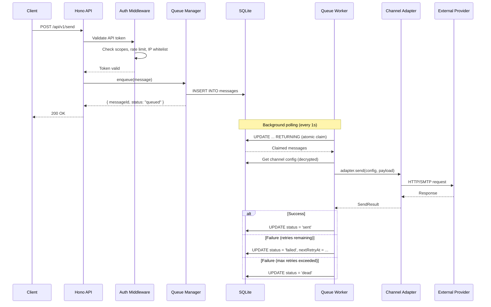
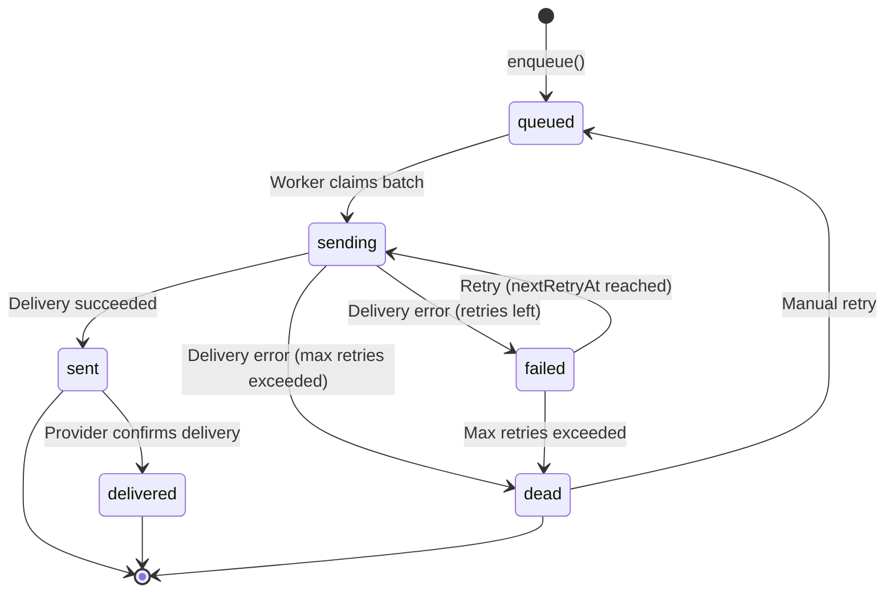
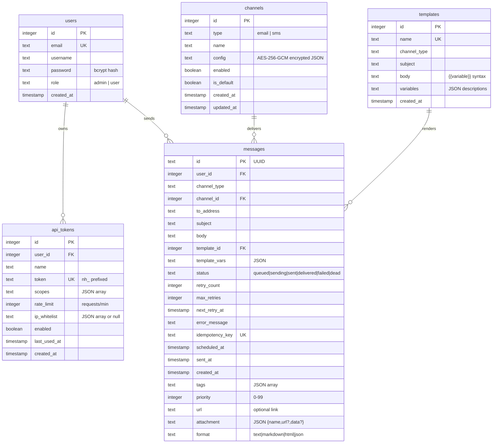

# Architecture

This document describes NotifyHub's system architecture, database schema, message lifecycle, and key design decisions. It is intended for developers who want to understand how the system works internally or plan to extend it.

## High-Level Architecture

NotifyHub is a monorepo containing four packages that work together:



## Request Flow

When a client sends a notification, the request passes through several stages before the message is delivered:



## Message Lifecycle

Every message moves through a state machine from creation to terminal state:



| Status | Description |
|--------|-------------|
| `queued` | Message is waiting to be processed. |
| `sending` | Worker has claimed the message and is attempting delivery. |
| `sent` | Message was successfully handed off to the provider. |
| `delivered` | Provider confirmed final delivery (not all providers support this). |
| `failed` | Delivery failed. Will be retried according to the backoff schedule. |
| `dead` | All retry attempts exhausted. Requires manual intervention. |

### Retry Strategy

Failed messages are retried with exponential backoff:

| Attempt | Delay | Cumulative Wait |
|---------|-------|-----------------|
| 1 | 1 second | 1s |
| 2 | 5 seconds | 6s |
| 3 | 30 seconds | 36s |
| 4 | 5 minutes | ~5.5 min |
| 5 | 30 minutes | ~35.5 min |

After 5 failed attempts, the message moves to the dead letter queue (`status = 'dead'`). You can manually retry dead messages from the dashboard or via the API.

## Database Schema

NotifyHub uses SQLite with Drizzle ORM. The database runs in WAL (Write-Ahead Logging) mode for better concurrent read performance.

### Entity Relationship Diagram



### Table Descriptions

**users** -- Stores admin and regular user accounts. Passwords are hashed with bcrypt (cost factor 10). The `role` field controls access: `admin` users can manage channels, tokens, and templates; `user` users have limited access.

**api_tokens** -- API tokens for the public send API. Each token has a set of scopes (channel types it can send to), a rate limit (requests per minute), and an optional IP whitelist. Tokens are prefixed with `nh_`.

**channels** -- Channel configurations (SMTP servers, SMS provider credentials). The `config` field stores JSON encrypted with AES-256-GCM. Each channel has a `type` (email, sms) and can be marked as the default for its type.

**templates** -- Reusable message templates. The `body` field supports `{{variable}}` syntax with optional default values (`{{name | default:"Guest"}}`). Templates are scoped to a channel type.

**messages** -- The message queue table. Messages are inserted with `status = 'queued'`, claimed atomically by the worker, and progress through the lifecycle states. Each message can carry extended metadata: `tags` (JSON array of labels), `priority` (0--99, higher = processed first), `url` (an associated link), `attachment` (JSON object with file name and URL or base64 data), and `format` (body rendering hint: text, markdown, html, json). Indexes on `status`, `createdAt`, and `nextRetryAt` keep the worker's polling queries fast.

## Directory Structure

```
notifyhub/
├── packages/
│   ├── shared/                # Shared types, constants, and Zod schemas
│   │   └── src/
│   │       ├── constants.ts   # Channel types, retry delays, config defaults
│   │       ├── schemas.ts     # Zod validation schemas
│   │       ├── types.ts       # TypeScript interfaces
│   │       └── index.ts       # Public exports
│   │
│   ├── server/                # API server (Hono + SQLite + Drizzle)
│   │   └── src/
│   │       ├── api/           # Route handlers
│   │       │   ├── admin/     # Admin-only routes (auth, channels, tokens, etc.)
│   │       │   ├── messages.ts # Public message query API
│   │       │   └── send.ts    # Public send API
│   │       ├── auth/          # JWT auth, API token auth, rate limiting
│   │       ├── channel/       # Channel adapter registry
│   │       │   ├── email/     # SMTP adapter (nodemailer)
│   │       │   └── sms/       # Twilio, Aliyun, Tencent adapters
│   │       ├── db/            # Drizzle schema, migrations, DB connection
│   │       ├── queue/         # Message queue manager and background worker
│   │       ├── template/      # Template rendering engine
│   │       ├── app.ts         # Hono app factory and bootstrap
│   │       ├── config.ts      # Environment config loader
│   │       ├── crypto.ts      # AES-256-GCM encrypt/decrypt
│   │       └── index.ts       # Server entry point
│   │
│   ├── web/                   # Admin dashboard (React + Vite + Tailwind)
│   │   └── src/
│   │       ├── components/    # Reusable UI components (shadcn/ui)
│   │       ├── layouts/       # Page layouts
│   │       ├── lib/           # API client, utilities, i18n
│   │       └── pages/         # Dashboard, Channels, Tokens, Messages, etc.
│   │
│   └── cli/                   # CLI tool (Commander.js)
│       └── src/
│           ├── commands/      # send, serve, config, status commands
│           └── lib/           # CLI config and API client
│
├── deploy/
│   ├── Dockerfile             # Multi-stage production build
│   └── docker-compose.yml     # Docker Compose configuration
│
├── .env.example               # Environment variable template
├── pnpm-workspace.yaml        # pnpm monorepo configuration
└── package.json               # Root package.json with shared scripts
```

## Key Design Decisions

### SQLite as Queue and Database

NotifyHub uses a single SQLite database for both application data and the message queue. This eliminates the need for a separate message broker (Redis, RabbitMQ) and simplifies deployment to a single process with a single data file.

SQLite in WAL mode handles concurrent reads efficiently. The worker uses a write transaction only when claiming messages and updating status, keeping lock contention minimal.

### Atomic Message Claiming

The worker claims messages using an `UPDATE ... RETURNING` pattern. This atomically transitions messages from `queued` (or `failed` with retry due) to `sending` in a single statement, preventing duplicate processing even if multiple workers were running:

```sql
UPDATE messages
SET status = 'sending'
WHERE id IN (
    SELECT id FROM messages
    WHERE status = 'queued'
       OR (status = 'failed' AND next_retry_at <= ?)
    ORDER BY created_at
    LIMIT 10
)
AND (status = 'queued' OR status = 'failed')
RETURNING *
```

The double-check on `status` in the `WHERE` clause guards against race conditions between the subquery and the update.

### Encrypted Channel Credentials

Channel configurations (SMTP passwords, API keys) are encrypted at the application level using AES-256-GCM before being written to the database. The encryption key is derived from the `ENCRYPTION_KEY` environment variable using `scryptSync`. This means that even if the SQLite file is compromised, the credentials remain protected.

### In-Memory Rate Limiting

Rate limiting uses an in-memory sliding window per API token. This is fast and sufficient for single-instance deployments. The rate limit is configured per token (default: 100 requests per minute) and enforced before the request reaches the handler.

:::note
If you scale NotifyHub to multiple instances, you would need to replace the in-memory rate limiter with a shared store (e.g., Redis). The current design assumes a single process.
:::

### Template Variable Syntax

The template engine uses `{{variable}}` double-brace syntax with optional default values:

```
Hello {{name | default:"Guest"}}, your order #{{orderId}} is ready.
```

Variables that are not provided and have no default value are left as-is (`{{variableName}}`), making it easy to spot unresolved placeholders during debugging.
