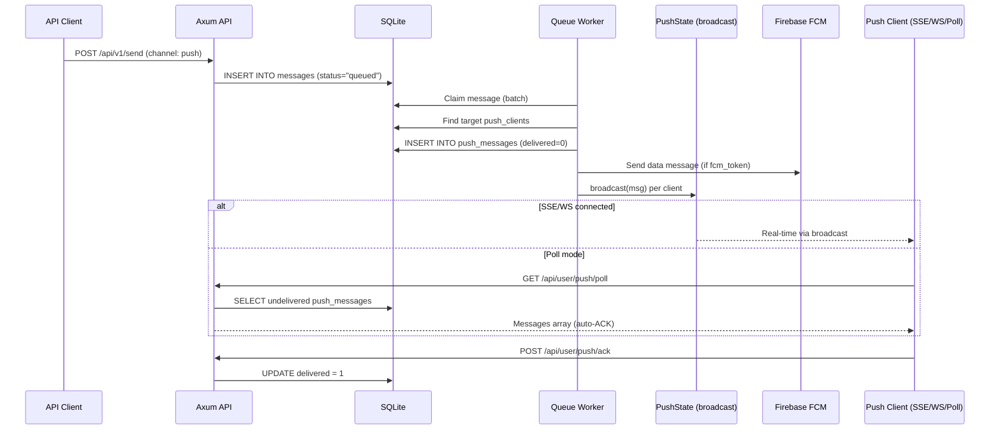
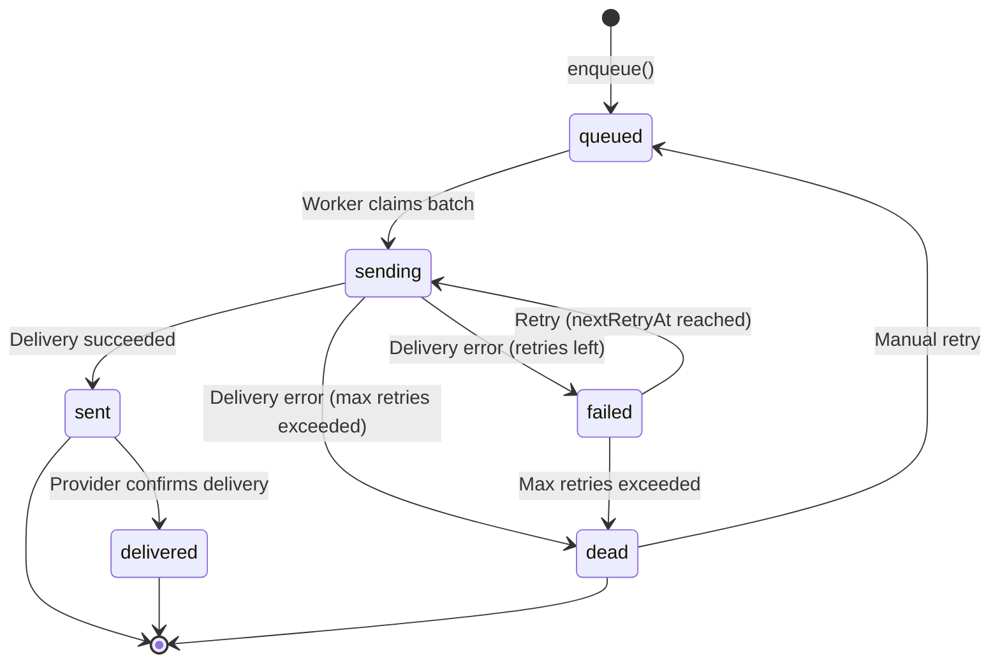
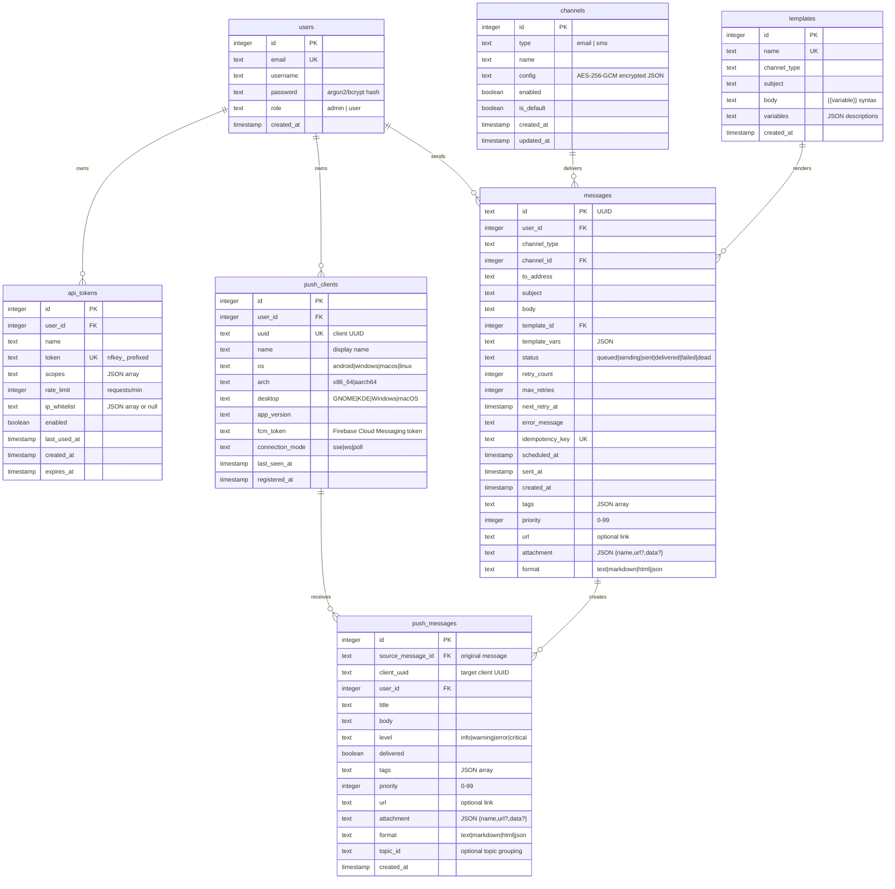

# Architecture

This document describes NotifyHub's system architecture, database schema, message lifecycle, and key design decisions. It is intended for developers who want to understand how the system works internally or plan to extend it.

## High-Level Architecture

NotifyHub is a monorepo containing several components that work together:

```mermaid
flowchart TB
    subgraph Clients
        Web[React Admin Dashboard]
        CLI[Rust CLI]
        Ext[External Applications]
        Android[Android Client]
        Tauri[Tauri Desktop Client]
    end

    subgraph Server ["API Server (Rust + Axum)"]
        API[REST API Routes]
        Auth[Auth Middleware]
        Queue[Message Queue]
        Worker[Background Worker]
        Push[Push State (broadcast)]
    end

    subgraph Storage
        SQLite[(SQLite DB)]
        Files[data/uploads/]
    end

    subgraph Providers
        SMTP[SMTP Server]
        Twilio[Twilio API]
        Aliyun[Aliyun SMS API]
        Tencent[Tencent SMS API]
    end

    Web -->|JWT Auth| API
    CLI -->|API Key / JWT| API
    Ext -->|API Key| API
    Android -->|SSE/WS/Poll + JWT| API
    Tauri -->|SSE/WS/Poll + JWT| API
    API --> Auth
    Auth --> Queue
    Queue --> SQLite
    SQLite --> Worker
    Worker --> SMTP
    Worker --> Twilio
    Worker --> Aliyun
    Worker --> Tencent
    Worker --> Push
    Push --> Android
    Push --> Tauri
    API --> Files
```

## Request Flow

When a client sends a notification, the request passes through several stages before the message is delivered:


## Push Delivery Flow

When a message is sent to the `push` channel, the worker creates push messages and broadcasts them to connected clients in real-time. On Android, FCM provides an additional parallel delivery path.



### Connection Modes

| Mode | Endpoint | Auth | Real-time | Notes |
|------|----------|------|-----------|-------|
| **SSE** | `GET /api/user/push/stream?uuid=&token=` | Query param or header | Yes | Unidirectional, 30s keep-alive |
| **WebSocket** | `GET /api/user/push/ws?uuid=&token=` | Query param | Yes | Bidirectional, ping/pong keepalive |
| **Poll** | `GET /api/user/push/poll?uuid=` | Header | No (5s interval) | Auto-ACK, compatible fallback |

JWT is validated at connection time. SSE/WS connections flush all undelivered messages on establishment before entering the real-time stream. On disconnect, clients reconnect with exponential backoff (5s → 120s).

:::tip Detailed docs
For the complete push delivery architecture including FCM integration, error handling, reconnection strategies, and client-specific behavior, see [Push Channel](/channels/push).
:::

## Message Lifecycle

Every message moves through a state machine from creation to terminal state:



| Status | Description |
|--------|-------------|
| `queued` | Message is waiting to be processed. |
| `sending` | Worker has claimed the message and is attempting delivery. |
| `sent` | Message was successfully handed off to the provider. |
| `delivered` | Provider confirmed final delivery (not all providers support this). |
| `failed` | Delivery failed. Will be retried according to the backoff schedule. |
| `dead` | All retry attempts exhausted. Requires manual intervention. |

### Retry Strategy

Failed messages are retried with exponential backoff:

| Attempt | Delay | Cumulative Wait |
|---------|-------|-----------------|
| 1 | 1 second | 1s |
| 2 | 5 seconds | 6s |
| 3 | 30 seconds | 36s |
| 4 | 5 minutes | ~5.5 min |
| 5 | 30 minutes | ~35.5 min |

After 5 failed attempts, the message moves to the dead letter queue (`status = 'dead'`). You can manually retry dead messages from the dashboard or via the API.

## Database Schema

NotifyHub uses SQLite with sqlx. The database runs in WAL (Write-Ahead Logging) mode for better concurrent read performance. Migrations are applied automatically on server startup.

### Entity Relationship Diagram



### Table Descriptions

**users** -- Stores admin and regular user accounts. Passwords are hashed with argon2 or bcrypt. The `role` field controls access: `admin` users can manage channels, tokens, and templates; `user` users have limited access.

**api_tokens** -- API tokens for the public send API. Each token has a set of scopes (channel types it can send to), a rate limit (requests per minute), and an optional IP whitelist. Tokens are prefixed with `nfkey_`.

**channels** -- Channel configurations (SMTP servers, SMS provider credentials). The `config` field stores JSON encrypted with AES-256-GCM. Each channel has a `type` (email, sms) and can be marked as the default for its type.

**templates** -- Reusable message templates. The `body` field supports `{{variable}}` syntax with optional default values (`{{name | default:"Guest"}}`). Templates are scoped to a channel type.

**messages** -- The message queue table. Messages are inserted with `status = 'queued'`, claimed atomically by the worker, and progress through the lifecycle states. Each message can carry extended metadata: `tags` (JSON array of labels), `priority` (0--99, higher = processed first), `url` (an associated link), `attachment` (JSON object with file name and URL or base64 data), and `format` (body rendering hint: text, markdown, html, json).

**push_clients** -- Registered push notification clients. Each client has a UUID, display name, OS info, and belongs to a user. The `fcm_token` field stores the Firebase Cloud Messaging token for Android devices. The `connection_mode` tracks the client's preferred transport (sse, ws, poll).

**push_messages** -- Queued push notifications. Created by the queue worker when a message targets the push channel. The `source_message_id` links back to the original message. `delivered` is set to `true` when the client acknowledges receipt via `POST /api/v1/push/ack` or when the poll endpoint returns the message.

## Directory Structure

```
notifyhub/
├── crates/               # Rust workspace
│   ├── common/                # Shared types, constants, error types
│   │   └── src/
│   │       ├── constants.rs   # Channel types, retry delays, JWT expiry
│   │       ├── schemas.rs     # Request/response schemas
│   │       ├── types.rs       # Shared types (ApiResponse, etc.)
│   │       └── error.rs       # AppError type
│   │
│   ├── server/                # API server (Axum + SQLite + sqlx)
│   │   └── src/
│   │       ├── auth/          # JWT, password hashing, middleware
│   │       ├── routes/        # API route handlers
│   │       │   ├── push.rs    # Push endpoints (poll, SSE, WS)
│   │       │   ├── send.rs    # Send API
│   │       │   ├── messages.rs # Message query API
│   │       │   └── admin.rs   # Admin routes
│   │       ├── worker/        # Queue worker, channel dispatchers
│   │       ├── db/            # Database init, migrations
│   │       ├── config.rs      # Environment config
│   │       └── main.rs        # Server entry point
│   │
│   └── cli/                   # CLI tool (clap)
│       └── src/
│           ├── commands/      # send, status, config commands
│           └── main.rs        # CLI entry point
│
├── web/                       # Admin dashboard (React + Vite + Tailwind)
│   └── src/
│       ├── components/        # Reusable UI components (shadcn/ui)
│       ├── lib/               # API client, utilities, i18n
│       └── pages/             # Dashboard, Channels, Tokens, Messages, etc.
│
├── desktop/                   # Desktop client (Tauri + Rust)
│   ├── src/
│   │   ├── api.rs             # API client (reqwest)
│   │   ├── config.rs          # Config file management
│   │   ├── messages.rs        # Local message store (JSON file)
│   │   ├── notify.rs          # Desktop notification bridge
│   │   ├── poll.rs            # Long-polling connection mode
│   │   ├── sse.rs             # SSE connection mode
│   │   ├── ws.rs              # WebSocket connection mode
│   │   └── main.rs            # Tauri app, tray menu, commands
│   └── ui/                    # Frontend (React + Vite)
│
├── android/                   # Android client (Kotlin + Jetpack Compose)
│   └── app/src/main/java/com/notifyhub/client/
│       ├── data/              # API client, models, message store, i18n
│       ├── service/           # PollService (SSE/WS/poll), FCM service
│       └── ui/                # Compose UI screens
│
├── docs/                      # Documentation site (Docusaurus)
├── deploy/                    # Docker deployment configs

```

## Key Design Decisions

### SQLite as Queue and Database

NotifyHub uses a single SQLite database for both application data and the message queue. This eliminates the need for a separate message broker (Redis, RabbitMQ) and simplifies deployment to a single process with a single data file.

SQLite in WAL mode handles concurrent reads efficiently. The worker uses a write transaction only when claiming messages and updating status, keeping lock contention minimal.

### Atomic Message Claiming

The worker claims messages using an `UPDATE ... RETURNING` pattern. This atomically transitions messages from `queued` (or `failed` with retry due) to `sending` in a single statement, preventing duplicate processing even if multiple workers were running.

### Rust Server with Axum

The server is built with Axum, a high-performance async HTTP framework for Rust. Benefits include:
- **Memory safety** without garbage collection
- **Zero-cost abstractions** for request handling
- **Compile-time SQL verification** via sqlx
- **Async I/O** with tokio for efficient concurrency
- **Single binary deployment** with no runtime dependencies

### Push State with Broadcast Channels

Real-time push delivery uses `tokio::sync::broadcast` channels. Each client UUID has a dedicated broadcast channel. When the queue worker creates a push message, it broadcasts to the target client's channel. SSE and WebSocket handlers subscribe to the channel and forward messages to connected clients.

This design decouples message production from delivery -- the worker doesn't need to know which clients are connected or how they're connected.

### Encrypted Channel Credentials

Channel configurations (SMTP passwords, API keys) are encrypted at the application level using AES-256-GCM before being written to the database. The encryption key is derived from the `JWT_SECRET` environment variable. This means that even if the SQLite file is compromised, the credentials remain protected.

### In-Memory Rate Limiting

Rate limiting uses an in-memory sliding window per API token. This is fast and sufficient for single-instance deployments. The rate limit is configured per token (default: 100 requests per minute) and enforced before the request reaches the handler.

:::note
If you scale NotifyHub to multiple instances, you would need to replace the in-memory rate limiter with a shared store (e.g., Redis). The current design assumes a single process.
:::

### Template Variable Syntax

The template engine uses `{{variable}}` double-brace syntax with optional default values:

```
Hello {{name | default:"Guest"}}, your order #{{orderId}} is ready.
```

Variables that are not provided and have no default value are left as-is (`{{variableName}}`), making it easy to spot unresolved placeholders during debugging.

### Client JWT with Long Expiry

Push client JWTs use a 90-day expiry (vs 24 hours for admin web login). This minimizes re-authentication for long-running desktop and Android clients. When a client's JWT expires, it automatically re-logs in using stored credentials and re-registers.
