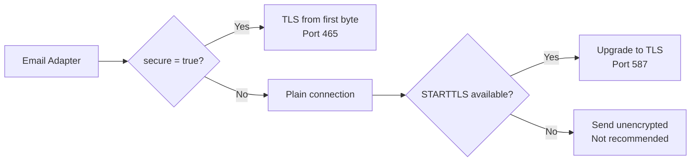

# Email Channel (SMTP)

The email channel delivers notifications over SMTP using [nodemailer](https://nodemailer.com/) under the hood. It supports TLS/SSL encryption, authentication, and works with any standards-compliant SMTP server.

## Setup Guide

### Step 1 -- Create the channel

Use the admin API to register a new email channel:

```bash
curl -X POST http://localhost:3000/api/admin/channels \
  -H "Authorization: Bearer <ADMIN_TOKEN>" \
  -H "Content-Type: application/json" \
  -d '{
    "type": "email",
    "name": "Production SMTP",
    "config": {
      "host": "smtp.example.com",
      "port": 587,
      "secure": false,
      "username": "notifications@example.com",
      "password": "your-smtp-password",
      "fromName": "NotifyHub",
      "fromAddress": "notifications@example.com"
    }
  }'
```

### Step 2 -- Test the connection

```bash
curl -X POST http://localhost:3000/api/admin/channels/{channelId}/test \
  -H "Authorization: Bearer <ADMIN_TOKEN>"
```

A successful test confirms the SMTP server is reachable and credentials are valid:

```json
{
  "success": true,
  "message": "SMTP connection verified successfully",
  "latencyMs": 142
}
```

### Step 3 -- Mark as default (optional)

If this is your primary email channel, set it as the default:

```bash
curl -X PATCH http://localhost:3000/api/admin/channels/{channelId} \
  -H "Authorization: Bearer <ADMIN_TOKEN>" \
  -H "Content-Type: application/json" \
  -d '{ "isDefault": true }'
```

## Configuration Fields

| Field | Type | Required | Description | Example |
|-------|------|----------|-------------|---------|
| `host` | string | Yes | SMTP server hostname. | `smtp.gmail.com` |
| `port` | number | Yes | SMTP server port. Common values: 25 (unencrypted), 465 (SSL), 587 (STARTTLS). | `587` |
| `secure` | boolean | Yes | If `true`, uses TLS from the start (port 465). If `false`, upgrades via STARTTLS (port 587). | `false` |
| `username` | string | Yes | SMTP authentication username. Often the same as `fromAddress`. | `notifications@example.com` |
| `password` | string | Yes | SMTP authentication password or app-specific password. | `your-smtp-password` |
| `fromName` | string | No | Display name shown in the "From" field. | `NotifyHub` |
| `fromAddress` | string | Yes | Email address used as the sender. Must be authorized on the SMTP server. | `notifications@example.com` |

:::tip
For Gmail, you must use an [App Password](https://support.google.com/accounts/answer/185833) rather than your regular account password, even if you have 2FA enabled.
:::

## Common SMTP Providers

The table below lists connection settings for popular email services:

| Provider | Host | Port | Secure | Notes |
|----------|------|------|--------|-------|
| **Gmail** | `smtp.gmail.com` | 587 | `false` | Requires App Password. STARTTLS. |
| **Outlook / Hotmail** | `smtp-mail.outlook.com` | 587 | `false` | STARTTLS. Use full email as username. |
| **SendGrid** | `smtp.sendgrid.net` | 587 | `false` | Username: `apikey`. Password: your API key. |
| **Mailgun** | `smtp.mailgun.org` | 587 | `false` | Use your Mailgun SMTP credentials (not API key). |
| **Amazon SES** | `email-smtp.us-east-1.amazonaws.com` | 587 | `false` | Region-specific hostname. Use IAM SMTP credentials. |
| **Yahoo Mail** | `smtp.mail.yahoo.com` | 465 | `true` | Requires App Password. Direct SSL. |

### Gmail Example

```json
{
  "host": "smtp.gmail.com",
  "port": 587,
  "secure": false,
  "username": "yourname@gmail.com",
  "password": "abcd efgh ijkl mnop",
  "fromName": "My App",
  "fromAddress": "yourname@gmail.com"
}
```

### SendGrid Example

```json
{
  "host": "smtp.sendgrid.net",
  "port": 587,
  "secure": false,
  "username": "apikey",
  "password": "SG.xxxxxxxxxxxxxxxxxxxx.xxxxxxxxxxxxxxxxxxxxxxxxxxxxxxxxxxxxxx",
  "fromName": "My App",
  "fromAddress": "noreply@yourdomain.com"
}
```

## Sending an Email via the API

Once the channel is configured and tested, send email notifications through the Send API:

```bash
curl -X POST http://localhost:3000/api/send \
  -H "Authorization: Bearer <APP_TOKEN>" \
  -H "Content-Type: application/json" \
  -d '{
    "type": "email",
    "to": "recipient@example.com",
    "subject": "Your order has shipped",
    "body": "<h1>Good news!</h1><p>Your order #12345 is on its way.</p>",
    "from": {
      "name": "My Store",
      "address": "noreply@mystore.com"
    }
  }'
```

If you omit the `from` field, NotifyHub uses the `fromName` and `fromAddress` from the channel configuration.

A successful response:

```json
{
  "success": true,
  "messageId": "b7e2f1a0-3c4d-5e6f-7890-abcd12345678",
  "channelId": "a1b2c3d4-e5f6-7890-abcd-ef1234567890",
  "accepted": ["recipient@example.com"]
}
```

### Sending to multiple recipients

```bash
curl -X POST http://localhost:3000/api/send \
  -H "Authorization: Bearer <APP_TOKEN>" \
  -H "Content-Type: application/json" \
  -d '{
    "type": "email",
    "to": ["alice@example.com", "bob@example.com"],
    "subject": "System maintenance window",
    "body": "<p>Scheduled maintenance on Saturday 2am-4am UTC.</p>"
  }'
```

## TLS and Security

NotifyHub handles TLS automatically based on the `secure` and `port` settings:



- **Port 465 + `secure: true`** -- Direct SSL/TLS connection. The entire session is encrypted from the start.
- **Port 587 + `secure: false`** -- STARTTLS. The connection starts unencrypted and upgrades to TLS after the server advertises support. This is the most common modern configuration.
- **Port 25** -- Typically unencrypted and often blocked by cloud providers. Avoid for production use.

:::warning
Never use port 25 without TLS for production email. Credentials sent over unencrypted connections can be intercepted.
:::

## Troubleshooting

### Connection timeout

**Symptom**: Test returns `ETIMEDOUT` or `ECONNREFUSED`.

**Solutions**:
- Verify the `host` and `port` are correct for your provider.
- Check that your firewall or cloud provider allows outbound connections on the target port. Many providers block port 25.
- If using a self-hosted SMTP server, confirm the service is running and accepting connections.

```bash
# Test raw SMTP connectivity from the NotifyHub host
telnet smtp.example.com 587
```

### Authentication failure

**Symptom**: Test returns `Invalid login: 535 Authentication failed`.

**Solutions**:
- Double-check `username` and `password`.
- For Gmail: ensure you are using an App Password, not your account password.
- For SendGrid: ensure `username` is literally the string `apikey`.
- Some providers require you to enable "SMTP access" or "less secure apps" in their dashboard.

### TLS / certificate errors

**Symptom**: Test returns `UNABLE_TO_VERIFY_LEAF_SIGNATURE` or `self signed certificate`.

**Solutions**:
- If you are connecting to a self-hosted SMTP server with a self-signed certificate, set the environment variable `NODE_TLS_REJECT_UNAUTHORIZED=0` (not recommended for production).
- Ensure the server's certificate chain is complete and valid.
- Verify the `secure` flag matches the port (465 = `true`, 587 = `false`).

### Emails sent but not received

**Symptom**: The API returns success, but the recipient does not see the email.

**Solutions**:
- Check the recipient's spam/junk folder.
- Verify your domain's SPF, DKIM, and DNS records are correctly configured.
- Some providers (Gmail, Outlook) throttle or reject mail from new/unverified senders. Start with low volume and warm up the sending domain.
- Review the SMTP server logs for deferred or bounced messages.

:::note
NotifyHub stores every message record regardless of delivery status. Check the [Messages API](/api/messages) to review delivery history and debug individual sends.
:::
