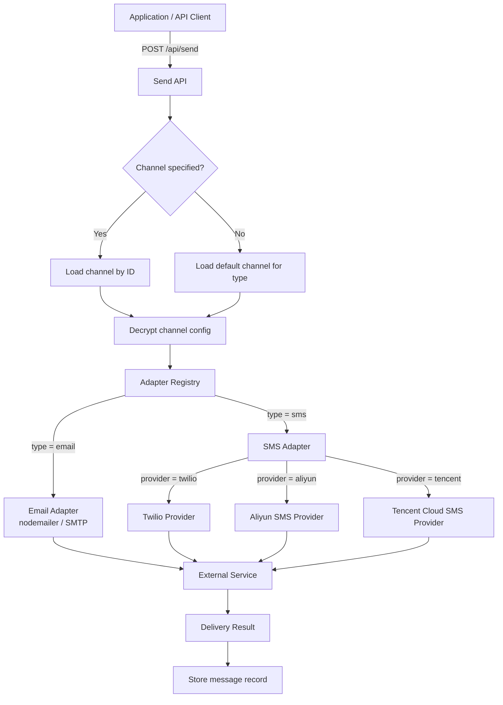
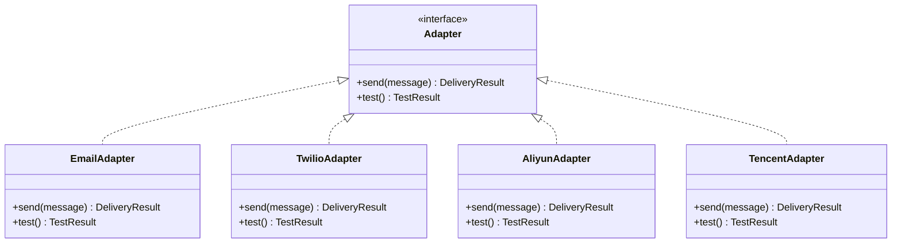

# Channel Overview

Channels are the delivery backends that NotifyHub uses to push notifications to recipients. Each channel represents a connection to an external service -- an SMTP server for email, or an SMS provider API for text messages. NotifyHub abstracts all providers behind a unified adapter pattern so that switching or adding a delivery backend never requires changes to your application code.

## Architecture

The following diagram shows how a notification request flows through the channel layer:



## Adapter Pattern

NotifyHub uses an **adapter registry** to decouple channel configuration from delivery logic. Every channel type implements a common adapter interface with two core methods:

| Method | Purpose |
|--------|---------|
| `send(message)` | Delivers a notification through the provider and returns a delivery result. |
| `test()` | Validates connectivity by performing a lightweight API call or handshake. Used when admins save or update a channel. |

### How it works

1. When the application starts, each adapter registers itself with the registry under a unique type key (e.g., `email`, `sms:twilio`, `sms:aliyun`, `sms:tencent`).
2. When a send request arrives, the service looks up the target channel in the database, decrypts its configuration JSON, and passes the config to the matching adapter.
3. The adapter constructs provider-specific API calls (e.g., SMTP envelope for email, REST/HMAC-signed request for SMS) and returns a standardized result.



## Configuration Encryption

All channel configurations are stored as **encrypted JSON** in the SQLite `channels` table. NotifyHub uses **AES-256-GCM** to encrypt the config blob before writing it to disk and decrypts it on read.

This means:

- API keys, passwords, and secrets are never stored in plaintext.
- The encryption key is derived from a secret you provide at deployment time (see [Deployment](/deployment/docker) for details).
- If the database file is leaked, channel credentials remain protected.

:::warning
If you lose the encryption key, all stored channel configurations become unrecoverable. Back up the key securely.
:::

## Default Channel Behavior

Each channel type can have exactly one **default** channel, controlled by the `isDefault` flag in the database.

- When a send request does not explicitly specify a `channelId`, NotifyHub selects the default channel matching the requested `type` (email or sms).
- Setting a channel as default automatically unsets the previous default for that type.
- If no default channel exists for a type and no `channelId` is provided, the API returns an error.

:::tip
Mark your most reliable provider as the default. You can always override the choice per-request by passing `channelId` in the send payload.
:::

## Supported Channel Types

| Type | Provider(s) | Status | Adapter Key |
|------|-------------|--------|-------------|
| Email | SMTP (nodemailer) | Stable | `email` |
| SMS | Twilio | Stable | `sms:twilio` |
| SMS | Aliyun SMS | Stable | `sms:aliyun` |
| SMS | Tencent Cloud SMS | Stable | `sms:tencent` |

## Database Schema

The `channels` table stores all registered channels:

| Column | Type | Description |
|--------|------|-------------|
| `id` | TEXT (UUID) | Primary key. Referenced by send requests as `channelId`. |
| `type` | TEXT | Channel type: `email` or `sms`. |
| `name` | TEXT | Human-readable label (e.g., "Production SMTP"). |
| `config` | TEXT | AES-256-GCM encrypted JSON blob containing provider credentials. |
| `enabled` | BOOLEAN | When `false`, the channel is skipped during send. |
| `isDefault` | BOOLEAN | Whether this channel is the default for its type. |
| `createdAt` | DATETIME | Timestamp of creation. |
| `updatedAt` | DATETIME | Timestamp of last modification. |

## Testing a Channel

Before using a channel in production, verify its connectivity with the admin test endpoint:

```bash
curl -X POST http://localhost:3000/api/admin/channels/{channelId}/test \
  -H "Authorization: Bearer <ADMIN_TOKEN>"
```

A successful response looks like:

```json
{
  "success": true,
  "message": "SMTP connection verified successfully",
  "latencyMs": 142
}
```

If the test fails, the response includes a diagnostic error:

```json
{
  "success": false,
  "error": "ECONNREFUSED: Connection refused to smtp.example.com:587",
  "latencyMs": 5003
}
```

:::note
The test endpoint calls the adapter's `test()` method, which performs a provider-specific health check -- for SMTP it opens and closes a connection, for SMS providers it validates credentials with a lightweight API call.
:::

## Channel Selection in the Send API

When calling the [Send API](/api/send), you control which channel delivers the message:

| Field | Required | Behavior |
|-------|----------|----------|
| `type` | Yes | `email` or `sms`. Determines which adapter class is used. |
| `channelId` | No | Specific channel UUID. If omitted, the default channel for the given `type` is used. |

Example -- send via a specific channel:

```json
{
  "type": "email",
  "channelId": "a1b2c3d4-e5f6-7890-abcd-ef1234567890",
  "to": "user@example.com",
  "subject": "Welcome",
  "body": "<h1>Hello!</h1>"
}
```

Example -- send via the default email channel:

```json
{
  "type": "email",
  "to": "user@example.com",
  "subject": "Welcome",
  "body": "<h1>Hello!</h1>"
}
```
