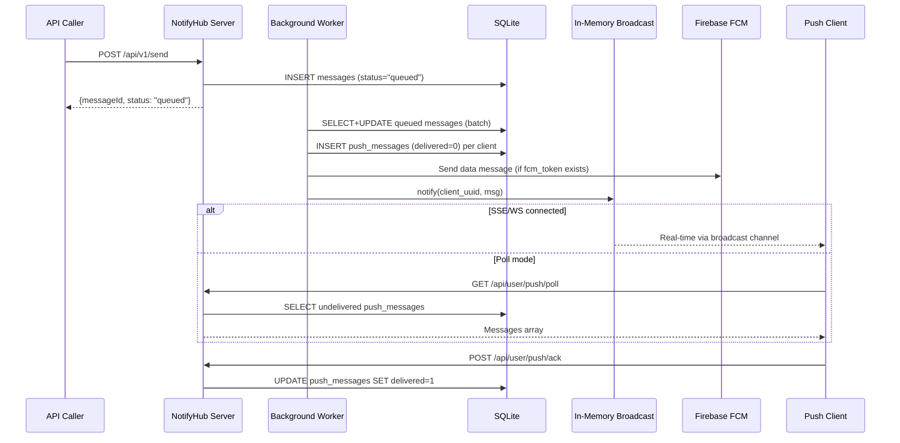
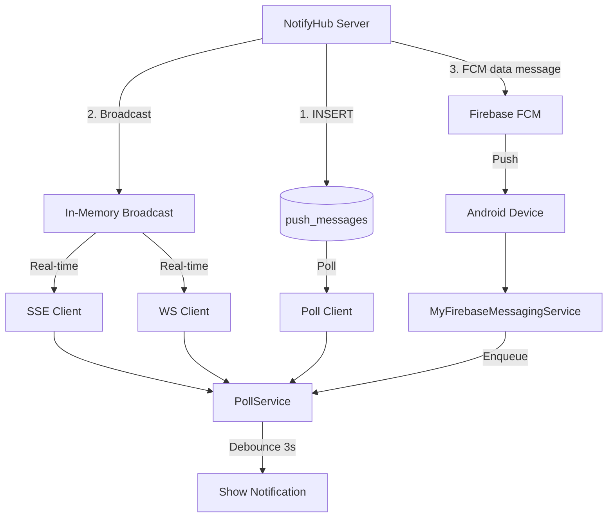

# Push Channel

Unlike Email and SMS which rely on external providers, the Push channel delivers messages directly to connected clients through the NotifyHub server itself. This doc covers the complete message lifecycle from API call to client notification, all three connection modes (SSE / WebSocket / Poll), FCM integration on Android, and the error-handling / reconnection strategies.

## End-to-End Message Flow



### Phase 1: Ingestion

`POST /api/v1/send` accepts the message payload and returns immediately:

1. **Auth**: DualAuth — JWT or API key (`nh_...` prefix).
2. **Idempotency**: If `idempotencyKey` is provided and already exists, returns the existing message.
3. **Template resolution**: If `template` is set, renders `{{var}}` / `{{var | default:"value"}}` placeholders.
4. **Channel resolution**: Looks up the default enabled channel of the requested type.
5. **Scheduling**: `scheduledAt` (datetime) or `delay` (relative: `30m`, `1h`, `1d`, `1w`) defers delivery.
6. **DB insert**: Inserts into `messages` with `status = "queued"`.

The handler returns `{ messageId, status: "queued" }` — delivery is **asynchronous**.

### Phase 2: Worker Processing

A background worker runs in an infinite loop:

1. **Batch claim**: `UPDATE ... RETURNING` atomically claims up to N messages where `status = 'queued'` (or `'failed'` with retries remaining), ordered by `priority DESC, created_at ASC`.
2. **Channel dispatch**: Routes by `ChannelType`:
   - **Email** → SMTP via lettre
   - **SMS** → Twilio / Aliyun / Tencent APIs
   - **Push** → Returns success immediately (delivery handled separately)
3. **Push delivery** (`create_push_messages`):
   - If `to` is `"*"` or empty → broadcasts to **all** user's clients
   - Otherwise → delivers to the specific client UUID
   - For each target client:
     - Inserts a `push_messages` row (`delivered = 0`)
     - Sends FCM data message (if client has `fcm_token` and FCM is configured)
     - Calls `push_state.notify(uuid, msg)` to wake SSE/WS subscribers

### Phase 3: Client Consumption

Messages reach clients through three parallel paths:

| Path | Mechanism | Latency | Durability |
|------|-----------|---------|------------|
| **SSE / WebSocket** | Real-time via in-memory broadcast | Instant | Lost if no subscriber connected |
| **Poll** | Client queries `push_messages` table | Poll interval (5s default) | Durable — survives disconnects |
| **FCM** (Android) | Firebase push to device | Near-instant | Handled by FCM infrastructure |

:::tip Dual delivery guarantee
SSE/WS messages are also persisted in `push_messages`. If a client reconnects after a disconnect, it receives all undelivered messages on connection establishment — before entering the real-time stream. This means no messages are lost even during temporary disconnections.
:::

### Phase 4: ACK and Cleanup

After consuming messages, clients ACK via `POST /api/user/push/ack`:

1. Marks `push_messages` rows as `delivered = 1`.
2. Checks if **all** `push_messages` for the source message are delivered.
3. If all delivered:
   - **No retention policy** (`messageExpiryDays = -1`): Deletes both `push_messages` and the source `messages` row.
   - **With retention**: Updates source `messages` status to `"delivered"`.

Poll mode **auto-ACKs** on fetch (no explicit ACK needed). SSE/WS clients must ACK explicitly.

---

## Connection Modes

### SSE (Server-Sent Events)

```
GET /api/user/push/stream?uuid={uuid}
Authorization: Bearer {jwt}
```

**How it works:**
- Server sends an initial `connected` event, then streams `data: {"data": [...]}` events.
- Undelivered messages are flushed on connection before entering the real-time stream.
- Server sends SSE comments (`:` lines) every **30 seconds** as keep-alive.
- Client reads the byte stream line-by-line, parsing `data: ` prefixed lines.

**Client timeouts:** 90 seconds read timeout (3× the keep-alive interval). If no data arrives within 90s, the connection is considered stale and reconnected.

**Auth note:** SSE connections pass the JWT as a query parameter (`?token=`) because some HTTP clients cannot set custom headers on EventSource-style connections.

### WebSocket

```
GET /api/user/push/ws?uuid={uuid}&token={jwt}
(Connection: Upgrade)
```

**How it works:**
- Upgrades HTTP to WebSocket via standard handshake.
- Server sends initial `{"event":"connected","data":{"connected":true}}` text frame.
- Undelivered messages are flushed, then real-time messages arrive as `{"data": [msg]}` text frames.
- Server sends **Ping** frames every 30 seconds; client must respond with **Pong**.
- Client-initiated **Close** is handled gracefully.

**Auth note:** JWT is passed as `?token=` query parameter in the WebSocket URL, since the WS handshake does not support custom `Authorization` headers in most client libraries.

### Poll

```
GET /api/user/push/poll?uuid={uuid}&limit=50
Authorization: Bearer {jwt}
```

**How it works:**
- Client calls this endpoint periodically (default every 5 seconds).
- Server returns all `push_messages` where `delivered = 0`, up to `limit` (max 200).
- Server **auto-ACKs** all returned messages (marks `delivered = 1`).
- Returns empty array `[]` when no new messages.

**When to use Poll:**
- Environments where persistent connections are unreliable (unstable networks, mobile battery constraints).
- Simple integration scenarios — no WebSocket/SSE client library needed.
- CLI tools and scripts.

### Mode Comparison

| Feature | SSE | WebSocket | Poll |
|---------|-----|-----------|------|
| Real-time delivery | ✅ Instant | ✅ Instant | ⏱ Up to poll interval |
| Persistent connection | ✅ | ✅ | ❌ |
| Battery friendly (mobile) | ⚠️ Moderate | ⚠️ Moderate | ✅ |
| Works behind proxies | ✅ | ⚠️ May need WSS | ✅ |
| Auto-ACK | ❌ | ❌ | ✅ |
| Reconnection complexity | Low | Low | None |
| Server memory per client | ~KB (broadcast slot) | ~KB (broadcast slot) | None |

---

## Android: FCM + Self-Hosted Push

Android has **four** delivery mechanisms. FCM works alongside the three self-hosted modes — they are **not** alternatives but complementary layers.

### Architecture



### FCM's Role

FCM is a **supplementary wake-up channel**, not a replacement for SSE/WS/Poll:

1. **Server sends FCM data messages** (not notification messages) in parallel with inserting into `push_messages` and broadcasting.
2. **Data-only messages** ensure the Android app controls notification display entirely — no duplicate notifications from FCM.
3. **Reliability layer**: If the SSE/WS connection drops silently (e.g., network switch, device sleep), FCM can wake the app.

:::info FCM is always-on when configured
FCM delivery runs **in parallel** with the selected self-hosted mode (SSE/WS/Poll). It is not a fallback — it's an additional delivery path. The client deduplicates by message ID.
:::

### Self-Hosted Mode Selection

The user selects one of three modes in Android settings:

| Mode | Class | Transport |
|------|-------|-----------|
| SSE | `SseClient` | OkHttp EventSource |
| WebSocket | `WsClient` | OkHttp WebSocket |
| Poll | `PollService.startPollMode()` | HTTP GET loop |

**There is no automatic fallback between modes.** If the selected mode fails:
- Retries the same mode with **exponential backoff**: 5s → 10s → 20s → 40s → 80s → 120s (cap).
- On HTTP 401 (auth error): re-logs in with stored credentials, re-registers, and restarts.
- Mode switching is **explicit** — the user must choose a different mode in settings.

### Message Deduplication

Since the same message may arrive via FCM **and** SSE/WS/Poll:

1. All incoming messages are saved to `MessageStore` with deduplication by message ID.
2. `handleIncomingMessages()` checks for duplicates before showing notifications.
3. ACK is sent for all messages (including duplicates) to ensure server-side cleanup.

### Notification Debouncing

To prevent notification storms during reconnect (when a backlog of undelivered messages flushes):

1. Messages accumulate in `pendingMessages` queue.
2. Each new message resets a **3-second debounce timer**.
3. After 3 seconds of silence:
   - **≤ 5 messages**: Individual notifications.
   - **> 5 messages**: Batch summary notification + last 3 individually.

---

## Desktop / Tauri

Desktop supports SSE, WebSocket, and Poll with the same architecture as Android:

- **Mode selection**: Explicit via UI. Stored in `config.toml`.
- **No automatic fallback**: Each mode retries itself with exponential backoff (5s to 120s).
- **JWT refresh**: On 401, calls `try_refresh_jwt()` which re-logins with stored credentials and re-registers.
- **Notification debouncing**: Same 3-second silence window as Android.

### Image Auto-Download

Desktop and Android both auto-download image attachments (up to 5MB) when a message with an image URL is received. The image is cached locally and displayed in the notification.

---

## CLI

The CLI supports all three modes via flags:

```bash
notify listen --sse    # SSE mode
notify listen --ws     # WebSocket mode
notify listen --poll   # Poll mode (default)
```

**Differences from Desktop/Android:**
- On 401 auth error, the CLI prints an error and **exits** (no auto-re-login).
- Messages are printed to stdout and optionally written to a JSONL file.
- No notification debouncing — messages are displayed immediately.

---

## Error Handling

### Connection Errors

| Error | SSE/WS Behavior | Poll Behavior |
|-------|-----------------|---------------|
| Network timeout | Reconnect with backoff | Retry on next poll |
| HTTP 401 (JWT expired) | Re-login → re-register → restart | Re-login → re-register → restart |
| HTTP 403 | Re-login attempt | Re-login attempt |
| HTTP 5xx | Reconnect with backoff | Retry on next poll |
| WebSocket close | Reconnect with backoff | N/A |
| SSE stream end | Reconnect with backoff | N/A |

### Exponential Backoff

All clients use the same backoff strategy:

```
Attempt 1:  5 seconds
Attempt 2: 10 seconds
Attempt 3: 20 seconds
Attempt 4: 40 seconds
Attempt 5: 80 seconds
Attempt 6+: 120 seconds (cap)
```

Backoff **resets** on successful connection.

### ACK Retry

ACK calls are retried up to **3 times** with 1-second delays. Failed ACKs do not cause message re-delivery on the current connection, but messages remain `delivered = 0` in the database — so they will be re-delivered on the next SSE/WS connection or poll.

### Broadcast Lag

The in-memory broadcast channel has a 64-slot buffer per client. If a client falls behind (e.g., slow network), `Lagged` errors are silently skipped. The lost messages are still in `push_messages` and will be delivered on the next connection flush or poll.

---

## Server-Side Push State

### In-Memory Broadcast

`PushState` is a `HashMap<String, broadcast::Sender<Value>>` behind `Arc<RwLock<>>`:

- Each client UUID gets a `broadcast::channel(64)` — 64 slots for burst handling.
- `subscribe(uuid)`: Gets or creates the broadcast channel, returns a `Receiver`.
- `notify(uuid, msg)`: Sends through the broadcast. If no subscribers exist, the message is silently dropped from broadcast (but persists in DB).
- **Stale cleanup**: Runs every 300 seconds, removes channels with zero receivers.

### Database Tables

**`push_messages`** — Durable message queue for poll delivery:

| Column | Type | Description |
|--------|------|-------------|
| `id` | TEXT | UUID primary key |
| `user_id` | INTEGER | Owner |
| `client_uuid` | TEXT | Target client |
| `source_message_id` | TEXT | Original message ID |
| `title` | TEXT | Notification title |
| `body` | TEXT | Notification body |
| `level` | TEXT | Message level |
| `delivered` | INTEGER | 0 = pending, 1 = delivered |
| `created_at` | TEXT | Timestamp |

**`push_clients`** — Registered client devices:

| Column | Type | Description |
|--------|------|-------------|
| `uuid` | TEXT | Client UUID (primary identifier) |
| `user_id` | INTEGER | Owner |
| `name` | TEXT | Device name |
| `os` | TEXT | Operating system |
| `arch` | TEXT | CPU architecture |
| `desktop` | TEXT | Platform (android/desktop/cli) |
| `app_version` | TEXT | Client version |
| `fcm_token` | TEXT | Firebase registration token |
| `connection_mode` | TEXT | Last used mode (sse/ws/poll) |
| `last_seen_at` | TEXT | Last activity timestamp |
