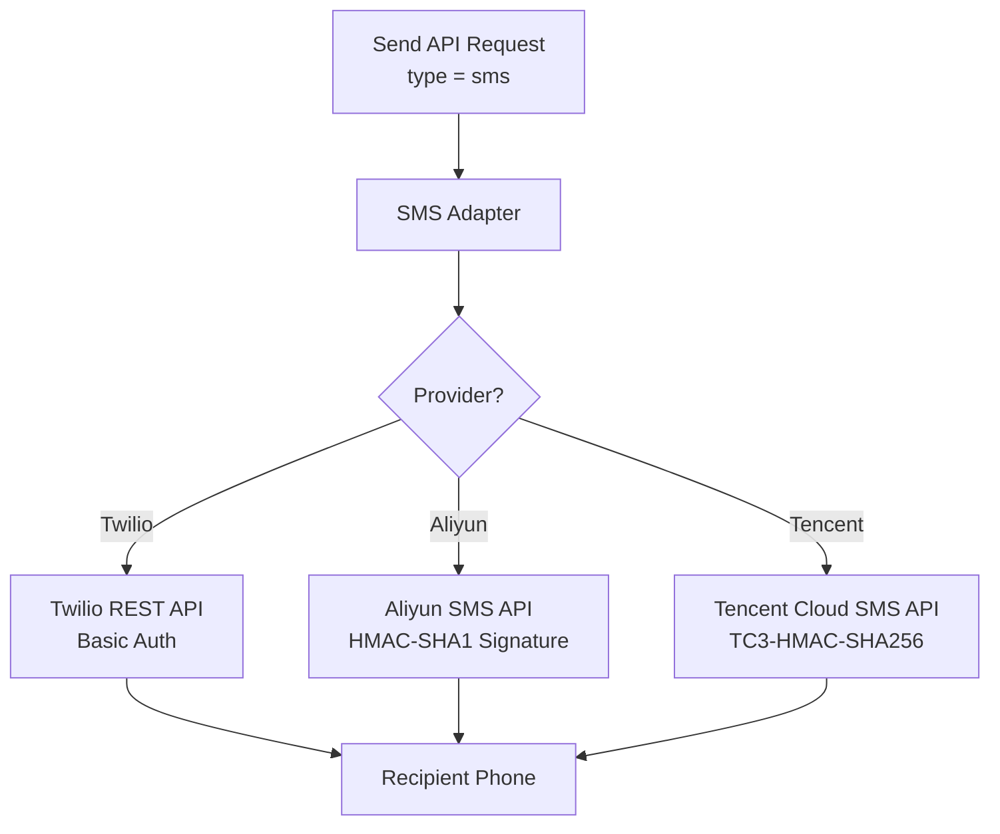
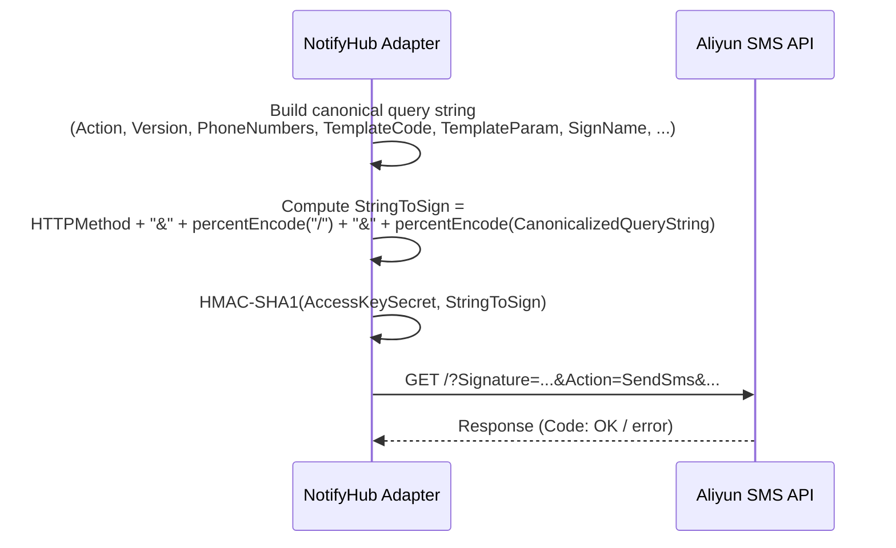
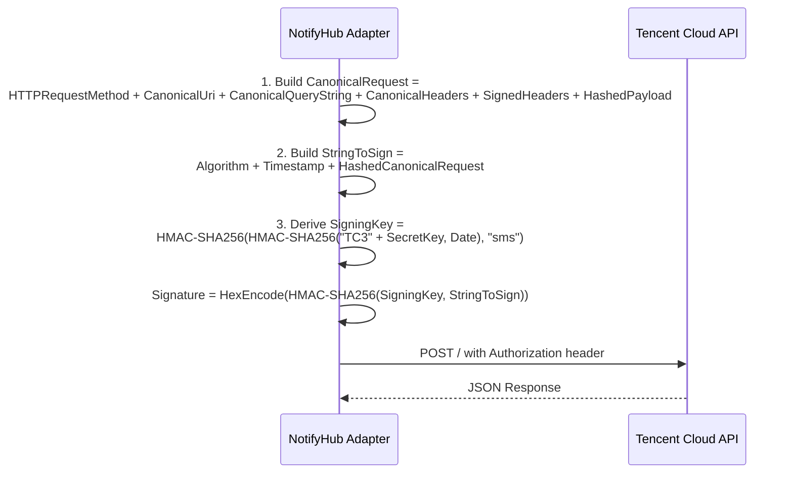

# SMS Channel

NotifyHub supports three SMS providers, each accessible through the unified adapter interface. All SMS providers use a **template-based** model: the message subject specifies the template code, and the message body carries the template parameters as a JSON string.

## Overview



## How SMS Sending Works

Unlike email, SMS delivery requires **pre-approved templates** on the provider side. NotifyHub maps the message fields as follows:

| API Field | Maps To | Description |
|-----------|---------|-------------|
| `subject` | Template code | The provider's template ID or code (e.g., `SMS_123456`). |
| `body` | Template parameters | A JSON string of key-value pairs substituted into the template. |
| `to` | Phone number(s) | Recipient phone numbers in E.164 format (e.g., `+1234567890`). |

Example send request:

```json
{
  "type": "sms",
  "to": "+1234567890",
  "subject": "SMS_123456",
  "body": "{\"code\": \"4392\", \"expire\": \"5\"}"
}
```

This sends the template `SMS_123456` with `{code}` replaced by `4392` and `{expire}` replaced by `5`.

:::note
Twilio is more flexible and does not strictly require templates -- you can send freeform text by leaving `subject` empty and putting the message in `body`. However, Aliyun and Tencent Cloud mandate template registration.
:::

---

## Twilio

Twilio provides a global SMS gateway accessible via REST API with HTTP Basic authentication.

### Configuration Fields

| Field | Type | Required | Description | Example |
|-------|------|----------|-------------|---------|
| `accountSid` | string | Yes | Your Twilio Account SID. Found on the Twilio Console dashboard. | `ACxxxxxxxxxxxxxxxxxxxxxxxxxxxxxxxx` |
| `authToken` | string | Yes | Your Twilio Auth Token. Found alongside the Account SID. | `your_auth_token` |
| `fromNumber` | string | Yes | A Twilio phone number or messaging service SID to send from. Must be in E.164 format. | `+15005550006` |

### Setup

1. Sign up at [twilio.com](https://www.twilio.com) and purchase a phone number with SMS capability.
2. Retrieve your **Account SID** and **Auth Token** from the [Twilio Console](https://console.twilio.com).
3. Create the channel:

```bash
curl -X POST http://localhost:9527/api/admin/channels \
  -H "Authorization: Bearer <ADMIN_TOKEN>" \
  -H "Content-Type: application/json" \
  -d '{
    "type": "sms",
    "name": "Twilio SMS",
    "config": {
      "provider": "twilio",
      "accountSid": "ACxxxxxxxxxxxxxxxxxxxxxxxxxxxxxxxx",
      "authToken": "your_auth_token",
      "fromNumber": "+15005550006"
    }
  }'
```

4. Test the connection:

```bash
curl -X POST http://localhost:9527/api/admin/channels/{channelId}/test \
  -H "Authorization: Bearer <ADMIN_TOKEN>"
```

### Sending via Twilio

```bash
curl -X POST http://localhost:9527/api/v1/send \
  -H "Authorization: Bearer <APP_TOKEN>" \
  -H "Content-Type: application/json" \
  -d '{
    "type": "sms",
    "to": "+14155551234",
    "body": "Your verification code is 847291."
  }'
```

Twilio also supports template-based sending:

```json
{
  "type": "sms",
  "to": "+14155551234",
  "subject": "HXxxxxxxxxxxxxxxxxxxxxxxxxxxxxxxxx",
  "body": "{\"code\": \"847291\"}"
}
```

---

## Aliyun SMS (Alibaba Cloud)

Aliyun SMS uses HMAC-SHA1 signed requests. All messages must use pre-approved templates registered in the [Aliyun SMS console](https://dysms.console.aliyun.com).

### Configuration Fields

| Field | Type | Required | Description | Example |
|-------|------|----------|-------------|---------|
| `accessKeyId` | string | Yes | Alibaba Cloud AccessKey ID. | `LTAI5tPxFcvNkWn5mGJqPz` |
| `accessKeySecret` | string | Yes | Alibaba Cloud AccessKey Secret. Used to sign requests with HMAC-SHA1. | `your_access_key_secret` |
| `signName` | string | Yes | Approved SMS signature displayed as the sender name. | `NotifyHub` |
| `endpoint` | string | No | API endpoint URL. Defaults to the public Aliyun SMS endpoint. | `https://dysmsapi.aliyuncs.com` |

### Signature Mechanism

Aliyun requires every API request to carry an HMAC-SHA1 signature computed over a canonical query string. NotifyHub handles this automatically:



### Setup

1. Log in to the [Alibaba Cloud console](https://home.console.aliyun.com) and create an AccessKey pair under RAM.
2. Register an SMS template and signature in the [Short Message Service console](https://dysms.console.aliyun.com). Note the template code (e.g., `SMS_123456`).
3. Create the channel:

```bash
curl -X POST http://localhost:9527/api/admin/channels \
  -H "Authorization: Bearer <ADMIN_TOKEN>" \
  -H "Content-Type: application/json" \
  -d '{
    "type": "sms",
    "name": "Aliyun SMS",
    "config": {
      "provider": "aliyun",
      "accessKeyId": "LTAI5tPxFcvNkWn5mGJqPz",
      "accessKeySecret": "your_access_key_secret",
      "signName": "NotifyHub",
      "endpoint": "https://dysmsapi.aliyuncs.com"
    }
  }'
```

4. Test the connection:

```bash
curl -X POST http://localhost:9527/api/admin/channels/{channelId}/test \
  -H "Authorization: Bearer <ADMIN_TOKEN>"
```

### Sending via Aliyun

```bash
curl -X POST http://localhost:9527/api/v1/send \
  -H "Authorization: Bearer <APP_TOKEN>" \
  -H "Content-Type: application/json" \
  -d '{
    "type": "sms",
    "to": "+8613800138000",
    "subject": "SMS_123456",
    "body": "{\"code\": \"4392\", \"expire\": \"5\"}"
  }'
```

In this example, `SMS_123456` is the Aliyun template code. The template content might be: `Your verification code is ${code}, valid for ${expire} minutes.`

---

## Tencent Cloud SMS

Tencent Cloud SMS uses the TC3-HMAC-SHA256 signature scheme. Like Aliyun, it requires pre-registered templates.

### Configuration Fields

| Field | Type | Required | Description | Example |
|-------|------|----------|-------------|---------|
| `secretId` | string | Yes | Tencent Cloud Secret ID. | `your_secret_id` |
| `secretKey` | string | Yes | Tencent Cloud Secret Key. Used to compute the TC3-HMAC-SHA256 signature. | `your_secret_key` |
| `signName` | string | Yes | Approved SMS signature. | `NotifyHub` |
| `sdkAppId` | string | Yes | SMS application ID created in the Tencent Cloud console. | `1400000000` |
| `endpoint` | string | No | API endpoint. Defaults to the public Tencent Cloud SMS endpoint. | `https://sms.tencentcloudapi.com` |

### Signature Mechanism (TC3-HMAC-SHA256)

Tencent Cloud uses a three-step signature process:



### Setup

1. Log in to the [Tencent Cloud console](https://console.cloud.tencent.com) and create a SecretId/SecretKey pair under CAM.
2. Create an SMS application and register a template and signature in the [SMS console](https://console.cloud.tencent.com/smsv2). Note the `SdkAppId` and template ID.
3. Create the channel:

```bash
curl -X POST http://localhost:9527/api/admin/channels \
  -H "Authorization: Bearer <ADMIN_TOKEN>" \
  -H "Content-Type: application/json" \
  -d '{
    "type": "sms",
    "name": "Tencent Cloud SMS",
    "config": {
      "provider": "tencent",
      "secretId": "your_secret_id",
      "secretKey": "your_secret_key",
      "signName": "NotifyHub",
      "sdkAppId": "1400000000",
      "endpoint": "https://sms.tencentcloudapi.com"
    }
  }'
```

4. Test the connection:

```bash
curl -X POST http://localhost:9527/api/admin/channels/{channelId}/test \
  -H "Authorization: Bearer <ADMIN_TOKEN>"
```

### Sending via Tencent Cloud

```bash
curl -X POST http://localhost:9527/api/v1/send \
  -H "Authorization: Bearer <APP_TOKEN>" \
  -H "Content-Type: application/json" \
  -d '{
    "type": "sms",
    "to": "+8613800138000",
    "subject": "123456",
    "body": "{\"code\": \"4392\"}"
  }'
```

Here, `123456` is the Tencent template ID. The `body` contains the parameters to substitute.

---

## Provider Comparison

| Feature | Twilio | Aliyun SMS | Tencent Cloud SMS |
|---------|--------|------------|-------------------|
| **Auth method** | HTTP Basic Auth (SID + Token) | HMAC-SHA1 signature | TC3-HMAC-SHA256 signature |
| **Template required** | Optional (freeform supported) | Yes (mandatory) | Yes (mandatory) |
| **Global coverage** | 180+ countries | China + select international | China + select international |
| **Sender ID format** | E.164 phone number or Messaging Service SID | Approved sign name | Approved sign name |
| **Signature complexity** | None (Basic Auth) | Moderate (HMAC-SHA1) | High (three-step HMAC-SHA256) |
| **Best for** | Global / international SMS | China mainland, Alibaba Cloud users | China mainland, Tencent Cloud users |
| **Config fields** | 3 | 4 | 5 |

:::tip
If you are targeting users in mainland China, Aliyun or Tencent Cloud are generally the better choice due to regulatory compliance and local carrier agreements. For global reach, Twilio is the most straightforward option.
:::

## Sending SMS via the API

All three providers use the same Send API interface. The only difference is which `channelId` you target (or which provider is set as the default).

### Minimal request (Twilio freeform)

```bash
curl -X POST http://localhost:9527/api/v1/send \
  -H "Authorization: Bearer <APP_TOKEN>" \
  -H "Content-Type: application/json" \
  -d '{
    "type": "sms",
    "to": "+14155551234",
    "body": "Hello from NotifyHub!"
  }'
```

### Template-based request (Aliyun / Tencent)

```bash
curl -X POST http://localhost:9527/api/v1/send \
  -H "Authorization: Bearer <APP_TOKEN>" \
  -H "Content-Type: application/json" \
  -d '{
    "type": "sms",
    "channelId": "channel-uuid-here",
    "to": "+8613800138000",
    "subject": "SMS_123456",
    "body": "{\"code\": \"4392\", \"expire\": \"5\"}"
  }'
```

### Sending to multiple recipients

```bash
curl -X POST http://localhost:9527/api/v1/send \
  -H "Authorization: Bearer <APP_TOKEN>" \
  -H "Content-Type: application/json" \
  -d '{
    "type": "sms",
    "to": ["+14155551234", "+14155555678"],
    "subject": "SMS_123456",
    "body": "{\"code\": \"4392\"}"
  }'
```

A successful response:

```json
{
  "success": true,
  "messageId": "f3e2d1c0-b9a8-7654-3210-fedcba987654",
  "channelId": "a1b2c3d4-e5f6-7890-abcd-ef1234567890",
  "accepted": ["+14155551234", "+14155555678"]
}
```

:::warning
SMS providers enforce rate limits and daily quotas. Monitor your provider dashboard to avoid hitting caps. NotifyHub does not throttle outbound SMS by default.
:::
