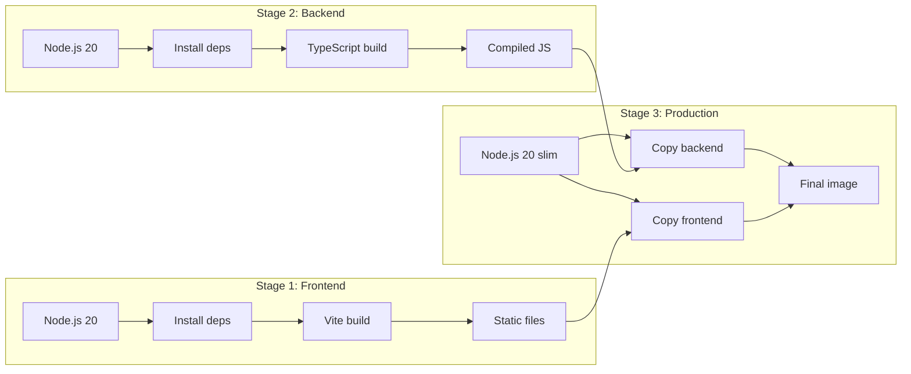

# Docker Deployment

The fastest way to run NotifyHub is with Docker. A single `docker compose up` starts the full stack.

## Quick Start

```bash
# Clone the repository
git clone https://github.com/notifyhub/notifyhub.git
cd notifyhub

# Create your environment file
cp .env.example .env
# Edit .env with your settings (see Environment Variables below)

# Start the stack
docker compose -f deploy/docker-compose.yml up -d

# Check it's running
curl http://localhost:9527/health
```

The service is available at `http://localhost:9527`. Log in with the admin credentials from `.env`.

## Dockerfile Explained

The Dockerfile uses a **multi-stage build** to keep the production image small.



| Stage | What it does | Base |
|---|---|---|
| `frontend` | Install deps, run `vite build` → static assets | `node:20-alpine` |
| `backend` | Install deps, run `tsc` → compiled JS | `node:20-alpine` |
| `production` | Copy compiled JS + static files into slim runtime | `node:20-slim` |

Dev dependencies (TypeScript, Vite, etc.) are **not** in the final image.

## docker-compose.yml

```yaml
services:
  notifyhub:
    build:
      context: ..
      dockerfile: deploy/Dockerfile
    container_name: notifyhub
    restart: unless-stopped
    ports:
      - "9527:9527"
    env_file:
      - ../.env
    volumes:
      - notifyhub-data:/app/data

volumes:
  notifyhub-data:
    driver: local
```

## Environment Variables

Create a `.env` file in the project root:

```bash
# Server
PORT=9527
HOST=0.0.0.0

# Database (path inside the container)
DATABASE_URL=./data/notify-hub.db

# Admin account (created on first run)
ADMIN_EMAIL=admin@notifyhub.local
ADMIN_USERNAME=admin
ADMIN_PASSWORD=change-me-to-a-strong-password

# Security (auto-generated if not set, but set for persistence)
JWT_SECRET=your-random-64-char-string
ENCRYPTION_KEY=your-random-32-char-string

# CORS
CORS_ORIGIN=*
```

| Variable | Required | Default | Description |
|---|---|---|---|
| `PORT` | No | `9527` | Port the server listens on |
| `HOST` | No | `0.0.0.0` | Bind address |
| `DATABASE_URL` | No | `./data/notify-hub.db` | SQLite file path |
| `ADMIN_EMAIL` | No | `admin@notifyhub.local` | Initial admin email |
| `ADMIN_USERNAME` | No | `admin` | Initial admin username |
| `ADMIN_PASSWORD` | No | `admin123` | Initial admin password |
| `JWT_SECRET` | No | auto-generated | Secret for signing JWTs |
| `ENCRYPTION_KEY` | No | auto-generated | Key for encrypting credentials |
| `CORS_ORIGIN` | No | `*` | Allowed CORS origins |

:::warning
Change `ADMIN_PASSWORD`, `JWT_SECRET`, and `ENCRYPTION_KEY` before deploying to production.
:::

## Volume Mounting

The `notifyhub-data` volume maps to `/app/data` inside the container where SQLite lives.

```yaml
volumes:
  - notifyhub-data:/app/data
```

### Backing Up

```bash
# Copy the database out of the container
docker cp notifyhub:/app/data/notify-hub.db ./backup-$(date +%Y%m%d).db
```

### Bind Mount Alternative

```yaml
volumes:
  - ./data:/app/data
```

## SSL/TLS with Reverse Proxy

For production, put nginx in front that terminates TLS.

```nginx
server {
    listen 443 ssl http2;
    server_name notifyhub.yourdomain.com;

    ssl_certificate /etc/letsencrypt/live/notifyhub.yourdomain.com/fullchain.pem;
    ssl_certificate_key /etc/letsencrypt/live/notifyhub.yourdomain.com/privkey.pem;

    add_header Strict-Transport-Security "max-age=63072000" always;

    location / {
        proxy_pass http://127.0.0.1:9527;
        proxy_set_header Host $host;
        proxy_set_header X-Real-IP $remote_addr;
        proxy_set_header X-Forwarded-For $proxy_add_x_forwarded_for;
        proxy_set_header X-Forwarded-Proto $scheme;
    }
}
```

## Health Check

```http
GET /health
```

Returns `200 OK` with `{ "status": "ok" }`.

## Updating

```bash
cd notifyhub
git pull origin main
docker compose -f deploy/docker-compose.yml down
docker compose -f deploy/docker-compose.yml up -d --build
```

The database lives in the volume and persists across upgrades.

:::tip
Back up before upgrading:
```bash
docker cp notifyhub:/app/data/notify-hub.db ./pre-upgrade-backup.db
```
:::

## Troubleshooting

| Problem | Check |
|---|---|
| Container exits immediately | `docker compose logs notifyhub` |
| Cannot connect | `docker compose ps`, check port mapping |
| Database locked | Ensure only one container is running |
| Missing env vars | Check `.env` file exists and has all required values |
