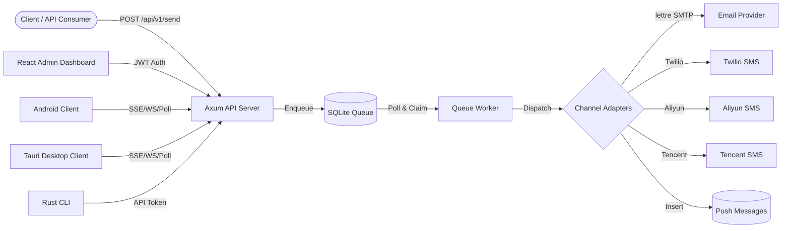

# NotifyHub Documentation

**NotifyHub** is a self-hosted notification push service designed for developers who need reliable, multi-channel message delivery without relying on third-party SaaS platforms. It provides a unified API for sending emails, SMS, and push notifications -- all from your own infrastructure.

## Key Features

- **Multi-channel delivery** -- Send notifications via Email (SMTP), SMS (Twilio, Aliyun SMS, Tencent Cloud SMS), and Push (SSE, WebSocket, long-polling) through a single API.
- **Push clients** -- Native Android, Tauri (desktop), and web clients that receive notifications in real-time via SSE, WebSocket, or long-polling. Auto-reconnect, offline mode, image auto-download, and system tray integration.
- **File attachments** -- Upload files via the API, attach them to messages. Clients can preview and download images, PDFs, and other files.
- **Template engine** -- Define message templates with `{{variable}}` syntax and default values. Reuse templates across channels.
- **Reliable queue** -- SQLite-backed message queue with atomic claiming, exponential backoff retry (1s, 5s, 30s, 5min, 30min), and dead letter support.
- **Secure by default** -- AES-256-GCM encryption for channel credentials, argon2/bcrypt password hashing, JWT authentication, and per-key rate limiting.
- **Multi-user** -- Role-based access control with admin and user roles. Email-based login with JWT sessions.
- **API key management** -- Create scoped keys with configurable rate limits and IP whitelists for the public API.
- **Self-hosted** -- SQLite database with WAL mode. No external dependencies beyond your chosen channel providers.
- **Modern web UI** -- React-based admin dashboard with dark mode, built on Tailwind CSS and shadcn/ui.

## Architecture Overview

NotifyHub follows a straightforward architecture: clients send messages through the REST API, the server enqueues them, and a background worker processes the queue by dispatching messages through the appropriate channel adapters.

### Push Delivery Modes

Push clients can connect using three different transport modes:

| Mode | Direction | Latency | Use Case |
|------|-----------|---------|----------|
| **SSE** | Server → Client | Real-time | Default for desktop and Android |
| **WebSocket** | Bidirectional | Real-time | When bidirectional communication is needed |
| **Long-Polling** | Client-initiated | Near real-time | Firewalls/restricted networks, fallback |

All modes authenticate via JWT (in `Authorization` header or `?token=` query parameter for WS/SSE). The server validates the token at connection time and maintains the stream until disconnection. If the JWT expires, clients automatically re-login and reconnect.

## Tech Stack

| Layer | Technology | Purpose |
|-------|-----------|---------|
| **API Server** | Rust + Axum | High-performance async HTTP framework |
| **Database** | SQLite + sqlx | Embedded database with compile-time checked queries |
| **Frontend** | React + Vite + Tailwind CSS | Admin dashboard with shadcn/ui components |
| **CLI** | Rust + clap | Fast command-line interface |
| **Desktop** | Tauri + Rust | Native desktop app with system tray |
| **Android** | Kotlin + Jetpack Compose | Material Design 3 mobile app |
| **Auth** | JWT + argon2/bcrypt | Token-based auth with secure password storage |
| **Encryption** | AES-256-GCM | Credential encryption at rest |
| **Email** | lettre | Async SMTP transport for email delivery |
| **SMS** | Twilio / Aliyun / Tencent APIs | Multi-provider SMS delivery |
| **Logging** | tracing | Structured JSON logging with env-filter |

## Quick Links

- **[Getting Started](./getting-started.md)** -- Install and run NotifyHub in 5 minutes.
- **[Architecture](./architecture.md)** -- Deep dive into system design, database schema, and message lifecycle.
- **[API Reference](./api/v1/send.md)** -- REST API documentation for sending messages.
- **[Channels](./channels/overview.md)** -- Configure email and SMS channel providers.
- **[Templates](./templates.md)** -- Create reusable message templates.
- **[Deployment](./deployment/docker.md)** -- Deploy NotifyHub with Docker or on a VPS.
- **[Development](./development.md)** -- Contribute to the project or extend its functionality.
