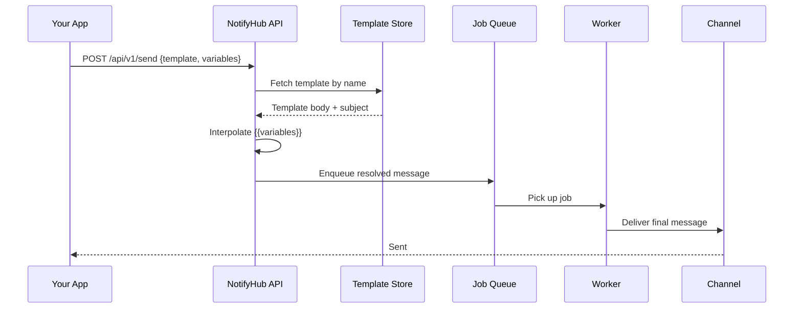

import MessageFlow from '@site/src/components/MessageFlow';

# Templates

Templates let you define reusable message bodies with placeholder variables that are filled in at send time. Instead of hard-coding every notification, you create a template once and supply different variables each time you send.

## How Templates Work



Templates are resolved **at enqueue time**. The worker receives an already-resolved message with all variables replaced.

- Variable values are frozen when you call the send API.
- Changing a template after sending does not affect messages already in the queue.
- Each channel type (`email`, `sms`) has its own set of templates.

## Template Syntax

### Basic Variable

Wrap a variable name in double curly braces:

```text
Hello {{name}}, welcome to NotifyHub!
```

Send with `variables: { name: "Alice" }` → `Hello Alice, welcome to NotifyHub!`

### Default Values

Provide a fallback when a variable might be missing:

```text
Hello {{name | default:"there"}}, your code is {{code}}.
```

If `name` is not provided, the output becomes: `Hello there, your code is 984321.`

### Syntax Rules

| Feature | Syntax | Example |
|---|---|---|
| Simple variable | `{{varName}}` | `{{order_id}}` |
| With default | `{{varName \| default:"fallback"}}` | `{{name \| default:"Customer"}}` |
| Allowed characters | Letters, digits, underscores | `{{user_name}}`, `{{code2}}` |
| Nesting | Not supported | `{{outer {{inner}}}}` will not work |

:::tip
Variable names are case-sensitive. `{{Name}}` and `{{name}}` are two different variables.
:::

:::caution
Templates are resolved once at enqueue time. If a variable is missing and has no default, it is replaced with an empty string.
:::

## Creating Templates

### Via Admin UI

1. Open the NotifyHub dashboard.
2. Navigate to **Templates** in the sidebar.
3. Click **New Template**.
4. Fill in:
   - **Name** — a unique identifier (e.g. `order_shipped`).
   - **Channel Type** — `email` or `sms`.
   - **Subject** — (email only) also supports `{{variable}}` syntax.
   - **Body** — the message body with variable placeholders.
5. Click **Create**.

### Via API

```bash
curl -X POST http://localhost:9527/api/admin/templates \
  -H "Authorization: Bearer <your-jwt>" \
  -H "Content-Type: application/json" \
  -d '{
    "name": "order_confirmation",
    "channelType": "email",
    "subject": "Order {{order_id}} Confirmed",
    "body": "Hi {{name}},\n\nYour order {{order_id}} has been confirmed.\nTotal: {{total}}\n\nThank you!"
  }'
```

## Sending with Templates

Pass the `template` name and `variables` object in the send API call.

### curl

```bash
curl -X POST http://localhost:9527/api/v1/send \
  -H "Authorization: Bearer nh_your_token_here" \
  -H "Content-Type: application/json" \
  -d '{
    "channel": "email",
    "to": "customer@example.com",
    "template": "order_confirmation",
    "variables": {
      "name": "John",
      "order_id": "ORD-98765",
      "total": "$42.00"
    }
  }'
```

### JavaScript

```typescript
const response = await fetch("http://localhost:9527/api/v1/send", {
  method: "POST",
  headers: {
    Authorization: "Bearer nh_your_token_here",
    "Content-Type": "application/json",
  },
  body: JSON.stringify({
    channel: "email",
    to: "customer@example.com",
    template: "order_confirmation",
    variables: { name: "John", order_id: "ORD-98765", total: "$42.00" },
  }),
});
```

### Python

```python
import requests

resp = requests.post(
    "http://localhost:9527/api/v1/send",
    headers={"Authorization": "Bearer nh_your_token_here"},
    json={
        "channel": "email",
        "to": "customer@example.com",
        "template": "order_confirmation",
        "variables": {"name": "John", "order_id": "ORD-98765", "total": "$42.00"},
    },
)
```

## Per-Channel Templates

Each template is bound to a single channel type. Create separate templates for each channel.

| Channel | Subject field | Body limit | Notes |
|---|---|---|---|
| `email` | Yes (supports variables) | No hard limit | Supports HTML |
| `sms` | No | ~160 chars (GSM) | Keep it short |

## Examples

### Order Confirmation (Email)

```text
Subject: Order {{order_id}} Confirmed

Hi {{name}},

Your order {{order_id}} has been confirmed.

Items: {{item_count}} item(s)
Total: {{total}}
Estimated delivery: {{delivery_date | default:"3-5 business days"}}

Track your order at {{tracking_url}}.
```

### OTP Verification (SMS)

```text
Your {{app_name | default:"account"}} verification code is {{code}}. Expires in {{expiry | default:"10"}} minutes. Do not share this code.
```

## Inline Templates

You can also send an inline body directly without creating a saved template:

```bash
curl -X POST http://localhost:9527/api/v1/send \
  -H "Authorization: Bearer nh_your_token_here" \
  -H "Content-Type: application/json" \
  -d '{
    "channel": "sms",
    "to": "+1234567890",
    "body": "Hello {{name}}, your order is on the way!",
    "variables": { "name": "John" }
  }'
```

Inline bodies support the same `{{variable}}` and `{{var | default:"val"}}` syntax.

## Best Practices

1. **Name templates clearly** — use names like `order-shipped-email` or `otp-sms`.
2. **Always provide defaults** for optional variables.
3. **Keep SMS templates short** — stay under 160 characters.
4. **Test with real data** before going live.
5. **Changing a template** only affects future sends; in-flight messages are unaffected.
