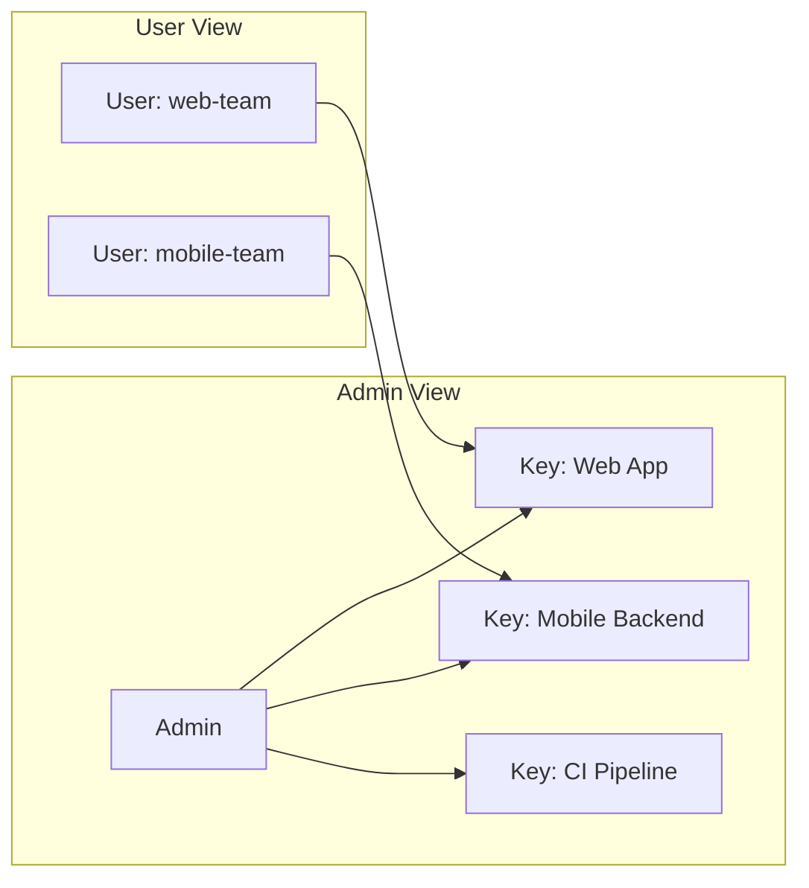

# API Keys

Every request to the NotifyHub public API requires a bearer token. Keys control who can send notifications, which channels they can use, and how fast they can send.

## Key Structure

```text
nh_a1b2c3d4e5f6g7h8i9j0k1l2m3n4o5p6
```

| Part | Description |
|---|---|
| `nh_` | Fixed prefix identifying it as a NotifyHub key |
| `a1b2c3...o5p6` | 32-character nanoid string (URL-safe, cryptographically random) |

Each key carries the following metadata:

| Field | Type | Description |
|---|---|---|
| `id` | number | Internal token ID |
| `name` | string | Human-readable label |
| `token` | string | The full bearer key (shown only once at creation) |
| `scopes` | string[] | Channel types this key may use: `email`, `sms`, `push` |
| `rateLimit` | number | Max requests per minute (sliding window) |
| `ipWhitelist` | string[] | Allowed source IPs; empty means no restriction |
| `enabled` | boolean | Whether the key is active |
| `userId` | number | Owner of this key |
| `lastUsedAt` | string \| null | ISO timestamp of last API call |

## Creating Keys

### Via Admin UI

1. Log in to the NotifyHub dashboard.
2. Go to **API Keys** in the sidebar.
3. Click **Create Key**.
4. Configure name, scopes, and rate limit.
5. **Copy the key immediately** — it is shown only once.

### Via API

```bash
curl -X POST http://localhost:9527/api/admin/tokens \
  -H "Authorization: Bearer <your-jwt>" \
  -H "Content-Type: application/json" \
  -d '{
    "name": "Production Backend",
    "scopes": ["email", "sms"],
    "rateLimit": 120
  }'
```

Response:

```json
{
  "success": true,
  "data": {
    "id": 4,
    "name": "Production Backend",
    "token": "nh_x9y8z7w6v5u4t3s2r1q0p9o8n7m6l5k4",
    "scopes": ["email", "sms"],
    "rateLimit": 120
  }
}
```

:::warning
The `token` field is returned only once, at creation time. Store it securely. If lost, create a new key and revoke the old one.
:::

## Key Scopes

Scopes control which channel types a key can send through.

| Scope | Allowed channels |
|---|---|
| `email` | Email only |
| `sms` | SMS only |
| `push` | Push notifications only |

Combine scopes as needed:

```json
{ "scopes": ["email", "push"] }
```

If a request tries to send through a channel not in the key's scopes, the API returns `403 Forbidden`.

## Rate Limiting

Each key has a per-minute rate limit enforced with a sliding window algorithm. When exceeded, the API returns `429 Too Many Requests` with a `Retry-After` header.

```text
Rate Limit: 60 requests/minute

00:00:00 - Request 1  ✅
00:00:01 - Request 2  ✅
...
00:00:59 - Request 60 ✅
00:01:00 - Request 61 ❌ 429 Too Many Requests
```

### Choosing a Rate Limit

| Use case | Suggested limit |
|---|---|
| Single backend service | 60–120 req/min |
| CI/CD pipeline | 30 req/min |
| High-volume transactional | 300+ req/min |
| Testing / development | 10–20 req/min |

## IP Whitelisting

When configured, the API only accepts requests from those IPs. All others receive `403 Forbidden`.

```json
{ "ipWhitelist": ["203.0.113.10", "198.51.100.5"] }
```

An empty array means no IP restriction.

:::tip
Use IP whitelisting for production backend services with static IPs. For development, leave it empty.
:::

## Per-User Key Isolation

Keys are scoped to the user who created them:

- **Regular users** see and manage only their own keys.
- **Admin users** see all keys across all users.



## Security Best Practices

1. **Never expose keys in client-side code.** Keep them on your backend.
2. **Use environment variables** to store keys.
3. **Create one key per service** for easy revocation.
4. **Set tight rate limits** — start low, increase as needed.
5. **Enable IP whitelisting** for production keys.
6. **Rotate keys periodically.**
7. **Monitor `lastUsedAt`** for unexpected activity.

## Using Keys in API Requests

### curl

```bash
curl -X POST http://localhost:9527/api/v1/send \
  -H "Authorization: Bearer nh_your_token_here" \
  -H "Content-Type: application/json" \
  -d '{
    "channel": "email",
    "to": "user@example.com",
    "subject": "Hello",
    "body": "This is a test notification."
  }'
```

### JavaScript

```typescript
const NOTIFYHUB_TOKEN = process.env.NOTIFYHUB_TOKEN;

async function sendNotification(to: string, subject: string, body: string) {
  const response = await fetch("http://localhost:9527/api/v1/send", {
    method: "POST",
    headers: {
      Authorization: `Bearer ${NOTIFYHUB_TOKEN}`,
      "Content-Type": "application/json",
    },
    body: JSON.stringify({ channel: "email", to, subject, body }),
  });

  if (response.status === 429) {
    const retryAfter = response.headers.get("Retry-After");
    throw new Error(`Rate limited. Retry after ${retryAfter} seconds.`);
  }

  return response.json();
}
```

### Python

```python
import os, requests

NOTIFYHUB_TOKEN = os.environ["NOTIFYHUB_TOKEN"]

def send_notification(to: str, subject: str, body: str) -> dict:
    resp = requests.post(
        "http://localhost:9527/api/v1/send",
        headers={"Authorization": f"Bearer {NOTIFYHUB_TOKEN}"},
        json={"channel": "email", "to": to, "subject": subject, "body": body},
    )
    if resp.status_code == 429:
        raise Exception(f"Rate limited. Retry after {resp.headers.get('Retry-After')}s.")
    resp.raise_for_status()
    return resp.json()
```

## Managing Keys

| Action | Method | Endpoint | Auth |
|---|---|---|---|
| List keys | GET | `/api/user/tokens` | JWT (admin sees all, user sees own) |
| Create key | POST | `/api/user/tokens` | JWT |
| Update key | PUT | `/api/user/tokens/:id` | JWT (owner or admin) |
| Delete key | DELETE | `/api/user/tokens/:id` | JWT (owner or admin) |

A disabled key (`enabled: false`) rejects all requests with `401 Unauthorized`. Re-enable by setting `enabled` back to `true`.
