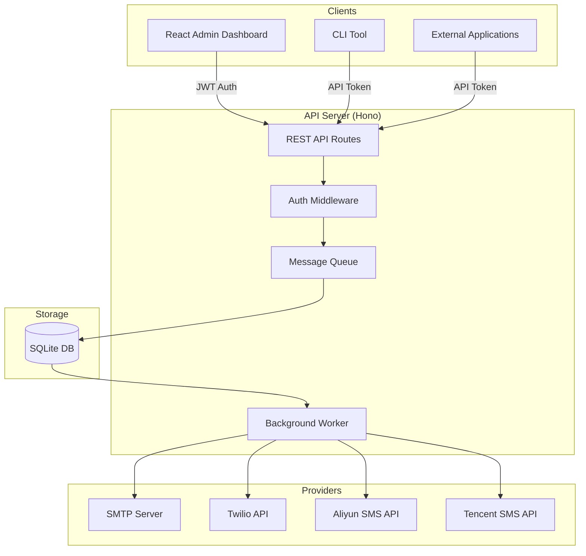
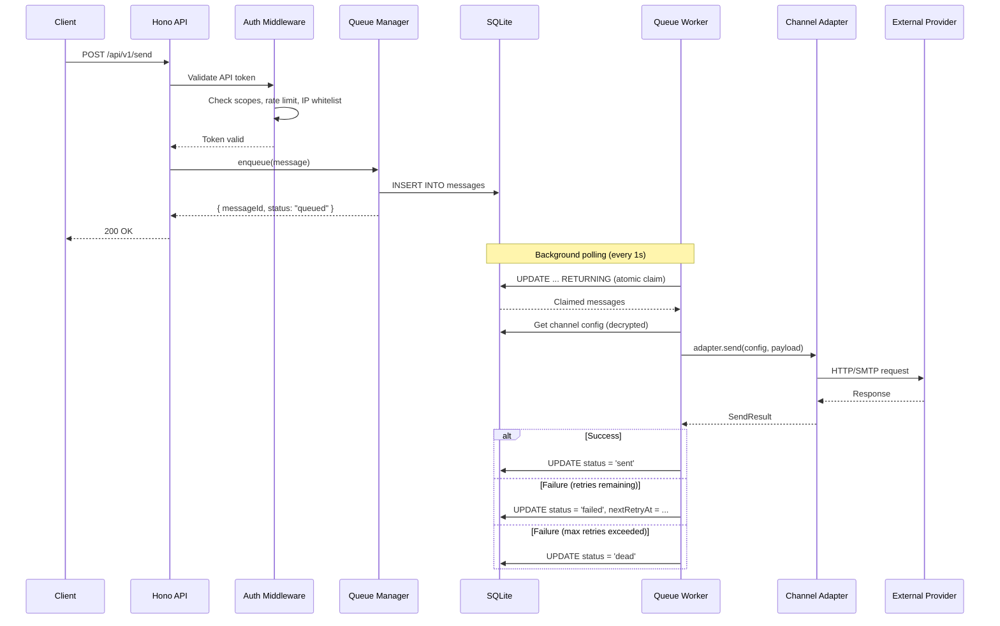
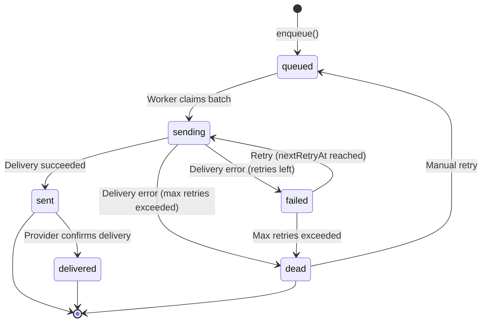
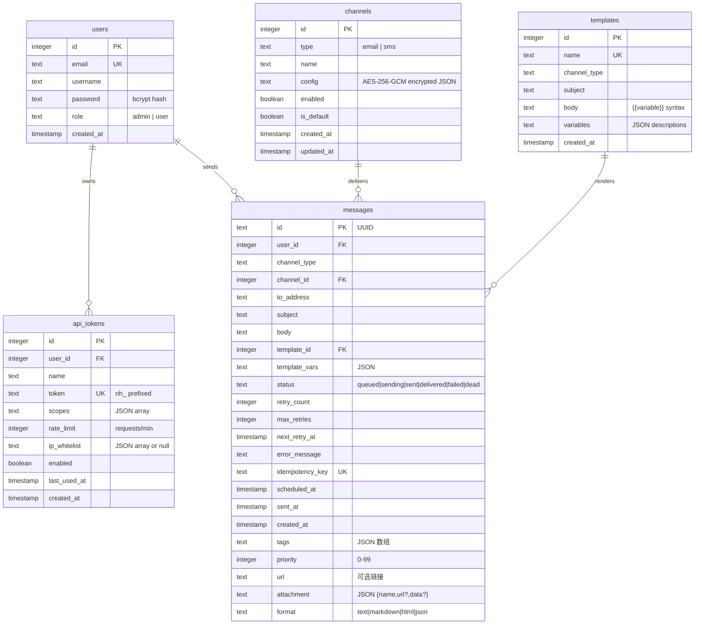

# 架构

本文档介绍 NotifyHub 的系统架构、数据库模型、消息生命周期以及核心设计决策。适用于希望了解系统内部工作原理或计划进行扩展的开发者。

## 整体架构

NotifyHub 是一个包含四个协同工作包（package）的 monorepo：



## 请求流程

当客户端发送通知时，请求在消息送达前会经过多个阶段：



## 消息生命周期

每条消息都会经历一个从创建到终态的状态机：



| 状态 | 说明 |
|--------|-------------|
| `queued` | 消息正在等待处理。 |
| `sending` | Worker 已认领该消息，正在尝试投递。 |
| `sent` | 消息已成功交给服务提供商。 |
| `delivered` | 服务提供商已确认最终送达（并非所有提供商都支持）。 |
| `failed` | 投递失败，将按照退避策略进行重试。 |
| `dead` | 所有重试次数已耗尽，需要人工介入。 |

### 重试策略

失败的消息会以指数退避（exponential backoff）方式进行重试：

| 尝试次数 | 延迟 | 累计等待时间 |
|---------|-------|-----------------|
| 1 | 1 秒 | 1s |
| 2 | 5 秒 | 6s |
| 3 | 30 秒 | 36s |
| 4 | 5 分钟 | ~5.5 min |
| 5 | 30 分钟 | ~35.5 min |

经过 5 次失败尝试后，消息将进入死信队列（dead letter queue，`status = 'dead'`）。您可以通过管理面板或 API 手动重试死信消息。

## 数据库模型

NotifyHub 使用 SQLite 配合 Drizzle ORM。数据库以 WAL（Write-Ahead Logging，预写日志）模式运行，以获得更好的并发读取性能。

### 实体关系图



### 表说明

**users** -- 存储管理员和普通用户账户。密码使用 bcrypt（cost factor 为 10）进行哈希。`role` 字段控制访问权限：`admin` 用户可以管理渠道、令牌和模板；`user` 用户具有有限的访问权限。

**api_tokens** -- 用于公共发送 API 的 API 令牌。每个令牌拥有一组作用域（可发送的渠道类型）、速率限制（每分钟请求数）以及可选的 IP 白名单。令牌以 `nh_` 为前缀。

**channels** -- 渠道配置（SMTP 服务器、短信服务提供商凭证）。`config` 字段存储使用 AES-256-GCM 加密的 JSON。每个渠道有一个 `type`（email、sms），并可标记为其类型的默认渠道。

**templates** -- 可复用的消息模板。`body` 字段支持 `{{variable}}` 语法，并可设置默认值（`{{name | default:"Guest"}}`）。模板按渠道类型进行作用域划分。

**messages** -- 消息队列表。消息插入时 `status = 'queued'`，由 Worker 原子认领（atomic claim），并沿生命周期状态流转。每条消息可携带扩展元数据：`tags`（JSON 标签数组）、`priority`（0--99，数值越高优先处理）、`url`（关联链接）、`attachment`（JSON 对象，包含文件名和 URL 或 Base64 数据）以及 `format`（正文渲染提示：text、markdown、html、json）。对 `status`、`createdAt` 和 `nextRetryAt` 建立的索引可保持 Worker 轮询查询的高效性。

## 目录结构

```
notifyhub/
├── /
│   ├── shared/                # Shared types, constants, and Zod schemas
│   │   └── src/
│   │       ├── constants.ts   # Channel types, retry delays, config defaults
│   │       ├── schemas.ts     # Zod validation schemas
│   │       ├── types.ts       # TypeScript interfaces
│   │       └── index.ts       # Public exports
│   │
│   ├── server/                # API server (Hono + SQLite + Drizzle)
│   │   └── src/
│   │       ├── api/           # Route handlers
│   │       │   ├── admin/     # Admin-only routes (auth, channels, tokens, etc.)
│   │       │   ├── messages.ts # Public message query API
│   │       │   └── send.ts    # Public send API
│   │       ├── auth/          # JWT auth, API token auth, rate limiting
│   │       ├── channel/       # Channel adapter registry
│   │       │   ├── email/     # SMTP adapter (nodemailer)
│   │       │   └── sms/       # Twilio, Aliyun, Tencent adapters
│   │       ├── db/            # Drizzle schema, migrations, DB connection
│   │       ├── queue/         # Message queue manager and background worker
│   │       ├── template/      # Template rendering engine
│   │       ├── app.ts         # Hono app factory and bootstrap
│   │       ├── config.ts      # Environment config loader
│   │       ├── crypto.ts      # AES-256-GCM encrypt/decrypt
│   │       └── index.ts       # Server entry point
│   │
│   ├── web/                   # Admin dashboard (React + Vite + Tailwind)
│   │   └── src/
│   │       ├── components/    # Reusable UI components (shadcn/ui)
│   │       ├── layouts/       # Page layouts
│   │       ├── lib/           # API client, utilities, i18n
│   │       └── pages/         # Dashboard, Channels, Tokens, Messages, etc.
│   │
│   └── cli/                   # CLI tool (Commander.js)
│       └── src/
│           ├── commands/      # send, serve, config, status commands
│           └── lib/           # CLI config and API client
│
├── deploy/
│   ├── Dockerfile             # Multi-stage production build
│   └── docker-compose.yml     # Docker Compose configuration
│
├── .env.example               # Environment variable template
├── pnpm-workspace.yaml        # pnpm monorepo configuration
└── package.json               # Root package.json with shared scripts
```

## 核心设计决策

### SQLite 作为队列和数据库

NotifyHub 使用单个 SQLite 数据库同时存储应用数据和消息队列。这消除了对独立消息中间件（如 Redis、RabbitMQ）的需求，并将部署简化为单进程 + 单数据文件。

WAL 模式下的 SQLite 能高效处理并发读取。Worker 仅在认领消息和更新状态时使用写事务，将锁竞争降至最低。

### 原子消息认领

Worker 使用 `UPDATE ... RETURNING` 模式认领消息。该模式在单条语句中原子地将消息从 `queued`（或重试到期的 `failed`）转换为 `sending`，即使有多个 Worker 运行也能防止重复处理：

```sql
UPDATE messages
SET status = 'sending'
WHERE id IN (
    SELECT id FROM messages
    WHERE status = 'queued'
       OR (status = 'failed' AND next_retry_at <= ?)
    ORDER BY created_at
    LIMIT 10
)
AND (status = 'queued' OR status = 'failed')
RETURNING *
```

`WHERE` 子句中对 `status` 的双重检查用于防止子查询与更新之间的竞态条件。

### 加密渠道凭证

渠道配置（SMTP 密码、API 密钥）在应用层使用 AES-256-GCM 加密后写入数据库。加密密钥通过 `scryptSync` 从 `ENCRYPTION_KEY` 环境变量派生。这意味着即使 SQLite 文件泄露，凭证仍然受到保护。

### 内存速率限制

速率限制使用基于每个 API 令牌的内存滑动窗口。速度快，足以满足单实例部署需求。速率限制按令牌配置（默认：每分钟 100 次请求），在请求到达处理器之前执行。

:::note
如果您将 NotifyHub 扩展到多个实例，则需要将内存速率限制器替换为共享存储（例如 Redis）。当前设计假设为单进程运行。
:::

### 模板变量语法

模板引擎使用 `{{variable}}` 双花括号语法，支持可选的默认值：

```
Hello {{name | default:"Guest"}}, your order #{{orderId}} is ready.
```

未提供且没有默认值的变量将保持原样（`{{variableName}}`），方便在调试时发现未解析的占位符。
