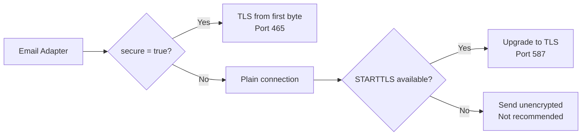

# 邮件渠道（SMTP）

邮件渠道通过底层使用 [nodemailer](https://nodemailer.com/) 经由 SMTP 投递通知。它支持 TLS/SSL 加密、认证，并兼容任何符合标准的 SMTP 服务器。

## 配置指南

### 第 1 步 -- 创建渠道

使用管理 API 注册新的邮件渠道：

```bash
curl -X POST http://localhost:3000/api/admin/channels \
  -H "Authorization: Bearer <ADMIN_TOKEN>" \
  -H "Content-Type: application/json" \
  -d '{
    "type": "email",
    "name": "Production SMTP",
    "config": {
      "host": "smtp.example.com",
      "port": 587,
      "secure": false,
      "username": "notifications@example.com",
      "password": "your-smtp-password",
      "fromName": "NotifyHub",
      "fromAddress": "notifications@example.com"
    }
  }'
```

### 第 2 步 -- 测试连接

```bash
curl -X POST http://localhost:3000/api/admin/channels/{channelId}/test \
  -H "Authorization: Bearer <ADMIN_TOKEN>"
```

测试成功表示 SMTP 服务器可达且凭据有效：

```json
{
  "success": true,
  "message": "SMTP connection verified successfully",
  "latencyMs": 142
}
```

### 第 3 步 -- 设为默认（可选）

如果这是你的主要邮件渠道，请将其设为默认：

```bash
curl -X PATCH http://localhost:3000/api/admin/channels/{channelId} \
  -H "Authorization: Bearer <ADMIN_TOKEN>" \
  -H "Content-Type: application/json" \
  -d '{ "isDefault": true }'
```

## 配置字段

| 字段 | 类型 | 是否必填 | 说明 | 示例 |
|-------|------|----------|-------------|---------|
| `host` | string | 是 | SMTP 服务器主机名。 | `smtp.gmail.com` |
| `port` | number | 是 | SMTP 服务器端口。常用值：25（未加密）、465（SSL）、587（STARTTLS）。 | `587` |
| `secure` | boolean | 是 | 设为 `true` 时从一开始就使用 TLS（端口 465）。设为 `false` 时通过 STARTTLS 升级（端口 587）。 | `false` |
| `username` | string | 是 | SMTP 认证用户名。通常与 `fromAddress` 相同。 | `notifications@example.com` |
| `password` | string | 是 | SMTP 认证密码或应用专用密码。 | `your-smtp-password` |
| `fromName` | string | 否 | "发件人" 字段中显示的名称。 | `NotifyHub` |
| `fromAddress` | string | 是 | 用作发件人的邮箱地址。必须在 SMTP 服务器上获得授权。 | `notifications@example.com` |

:::tip
对于 Gmail，你必须使用[应用专用密码](https://support.google.com/accounts/answer/185833)，而不是常规账户密码，即使你已启用两步验证也是如此。
:::

## 常见 SMTP 服务商

下表列出了常用邮件服务的连接设置：

| 服务商 | 主机 | 端口 | 安全连接 | 备注 |
|----------|------|------|--------|-------|
| **Gmail** | `smtp.gmail.com` | 587 | `false` | 需要应用专用密码。STARTTLS。 |
| **Outlook / Hotmail** | `smtp-mail.outlook.com` | 587 | `false` | STARTTLS。用户名使用完整邮箱地址。 |
| **SendGrid** | `smtp.sendgrid.net` | 587 | `false` | 用户名：`apikey`。密码：你的 API 密钥。 |
| **Mailgun** | `smtp.mailgun.org` | 587 | `false` | 使用 Mailgun SMTP 凭据（不是 API 密钥）。 |
| **Amazon SES** | `email-smtp.us-east-1.amazonaws.com` | 587 | `false` | 主机名因区域而异。使用 IAM SMTP 凭据。 |
| **Yahoo Mail** | `smtp.mail.yahoo.com` | 465 | `true` | 需要应用专用密码。直接 SSL。 |

### Gmail 示例

```json
{
  "host": "smtp.gmail.com",
  "port": 587,
  "secure": false,
  "username": "yourname@gmail.com",
  "password": "abcd efgh ijkl mnop",
  "fromName": "My App",
  "fromAddress": "yourname@gmail.com"
}
```

### SendGrid 示例

```json
{
  "host": "smtp.sendgrid.net",
  "port": 587,
  "secure": false,
  "username": "apikey",
  "password": "SG.xxxxxxxxxxxxxxxxxxxx.xxxxxxxxxxxxxxxxxxxxxxxxxxxxxxxxxxxxxx",
  "fromName": "My App",
  "fromAddress": "noreply@yourdomain.com"
}
```

## 通过 API 发送邮件

渠道配置并测试完成后，可通过发送 API 发送邮件通知：

```bash
curl -X POST http://localhost:3000/api/send \
  -H "Authorization: Bearer <APP_TOKEN>" \
  -H "Content-Type: application/json" \
  -d '{
    "type": "email",
    "to": "recipient@example.com",
    "subject": "Your order has shipped",
    "body": "<h1>Good news!</h1><p>Your order #12345 is on its way.</p>",
    "from": {
      "name": "My Store",
      "address": "noreply@mystore.com"
    }
  }'
```

如果你省略 `from` 字段，NotifyHub 将使用渠道配置中的 `fromName` 和 `fromAddress`。

成功响应：

```json
{
  "success": true,
  "messageId": "b7e2f1a0-3c4d-5e6f-7890-abcd12345678",
  "channelId": "a1b2c3d4-e5f6-7890-abcd-ef1234567890",
  "accepted": ["recipient@example.com"]
}
```

### 发送给多个收件人

```bash
curl -X POST http://localhost:3000/api/send \
  -H "Authorization: Bearer <APP_TOKEN>" \
  -H "Content-Type: application/json" \
  -d '{
    "type": "email",
    "to": ["alice@example.com", "bob@example.com"],
    "subject": "System maintenance window",
    "body": "<p>Scheduled maintenance on Saturday 2am-4am UTC.</p>"
  }'
```

## TLS 与安全

NotifyHub 根据 `secure` 和 `port` 设置自动处理 TLS：



- **端口 465 + `secure: true`** -- 直接 SSL/TLS 连接。整个会话从一开始就加密。
- **端口 587 + `secure: false`** -- STARTTLS。连接初始为未加密状态，在服务器声明支持后升级为 TLS。这是最常见的现代配置。
- **端口 25** -- 通常未加密，且经常被云服务商封锁。生产环境请避免使用。

:::warning
生产环境邮件切勿使用端口 25 而不启用 TLS。未加密连接上传输的凭据可能被截获。
:::

## 故障排除

### 连接超时

**症状**：测试返回 `ETIMEDOUT` 或 `ECONNREFUSED`。

**解决方案**：
- 验证 `host` 和 `port` 是否与你的服务商匹配。
- 检查防火墙或云服务商是否允许目标端口的出站连接。许多服务商会封锁端口 25。
- 如果使用自托管 SMTP 服务器，确认服务正在运行且接受连接。

```bash
# Test raw SMTP connectivity from the NotifyHub host
telnet smtp.example.com 587
```

### 认证失败

**症状**：测试返回 `Invalid login: 535 Authentication failed`。

**解决方案**：
- 仔细检查 `username` 和 `password`。
- 对于 Gmail：确保使用的是应用专用密码，而非账户密码。
- 对于 SendGrid：确保 `username` 就是字符串 `apikey`。
- 部分服务商要求在其控制台中启用 "SMTP 访问" 或 "安全性较低的应用"。

### TLS / 证书错误

**症状**：测试返回 `UNABLE_TO_VERIFY_LEAF_SIGNATURE` 或 `self signed certificate`。

**解决方案**：
- 如果你连接的自托管 SMTP 服务器使用自签名证书，可设置环境变量 `NODE_TLS_REJECT_UNAUTHORIZED=0`（不推荐用于生产环境）。
- 确保证书链完整且有效。
- 验证 `secure` 标志与端口匹配（465 = `true`，587 = `false`）。

### 邮件已发送但未收到

**症状**：API 返回成功，但收件人未看到邮件。

**解决方案**：
- 检查收件人的垃圾邮件/垃圾箱。
- 验证你的域名的 SPF、DKIM 和 DNS 记录是否正确配置。
- 部分服务商（Gmail、Outlook）会限制或拒绝来自新/未验证发件人的邮件。建议从小量开始，逐步提升发送域名的信誉。
- 查看 SMTP 服务器日志，检查是否有延迟或退回的消息。

:::note
NotifyHub 无论投递状态如何都会存储每条消息记录。可查看[消息 API](/api/messages) 以检查投递历史并调试单次发送。
:::
