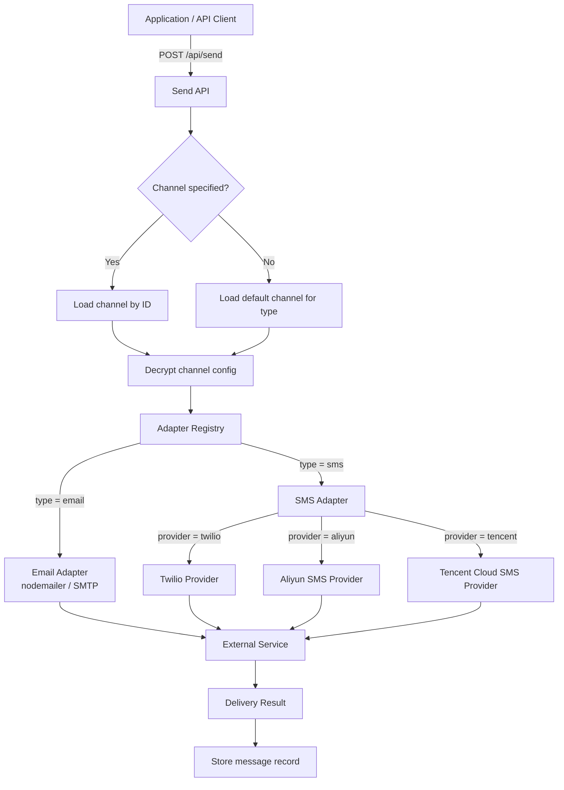
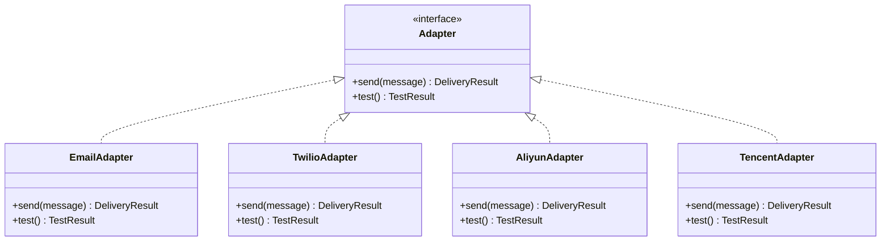

# 渠道概览

渠道是 NotifyHub 用于向收件人推送通知的投递后端。每个渠道代表与外部服务的连接 -- 用于邮件的 SMTP 服务器，或用于短信的短信服务商 API。NotifyHub 将所有服务商抽象到统一的适配器模式之后，因此切换或添加投递后端无需修改应用代码。

## 架构

下图展示了通知请求如何流经渠道层：



## 适配器模式

NotifyHub 使用**适配器注册表**将渠道配置与投递逻辑解耦。每种渠道类型都实现了包含两个核心方法的通用适配器接口：

| 方法 | 用途 |
|--------|---------|
| `send(message)` | 通过服务商投递通知并返回投递结果。 |
| `test()` | 通过轻量级 API 调用或握手来验证连通性。在管理员保存或更新渠道时使用。 |

### 工作原理

1. 应用启动时，每个适配器以唯一的类型键（如 `email`、`sms:twilio`、`sms:aliyun`、`sms:tencent`）注册到注册表中。
2. 当发送请求到达时，服务在数据库中查找目标渠道，解密其配置 JSON，并将配置传递给匹配的适配器。
3. 适配器构造服务商特定的 API 调用（如邮件的 SMTP 信封、短信的 REST/HMAC 签名请求），并返回标准化结果。



## 配置加密

所有渠道配置以**加密 JSON** 的形式存储在 SQLite 的 `channels` 表中。NotifyHub 使用 **AES-256-GCM** 在写入磁盘前加密配置数据块，并在读取时解密。

这意味着：

- API 密钥、密码和密钥永远不会以明文形式存储。
- 加密密钥由你在部署时提供的密钥派生（详见 [Docker 部署](/deployment/docker)）。
- 即使数据库文件泄露，渠道凭据仍然受到保护。

:::warning
如果你丢失了加密密钥，所有已存储的渠道配置将无法恢复。请安全地备份密钥。
:::

## 默认渠道行为

每种渠道类型可以有且仅有一个**默认**渠道，由数据库中的 `isDefault` 标志控制。

- 当发送请求未明确指定 `channelId` 时，NotifyHub 会选择与请求的 `type`（email 或 sms）匹配的默认渠道。
- 将某个渠道设为默认会自动取消该类型之前默认渠道的默认状态。
- 如果某类型没有默认渠道且未提供 `channelId`，API 将返回错误。

:::tip
将你最可靠的服务商标记为默认。你始终可以通过在发送请求中传递 `channelId` 来覆盖每个请求的选择。
:::

## 支持的渠道类型

| 类型 | 服务商 | 状态 | 适配器键 |
|------|-------------|--------|-------------|
| 邮件 | SMTP (nodemailer) | 稳定 | `email` |
| 短信 | Twilio | 稳定 | `sms:twilio` |
| 短信 | 阿里云短信 | 稳定 | `sms:aliyun` |
| 短信 | 腾讯云短信 | 稳定 | `sms:tencent` |

## 数据库模型

`channels` 表存储所有已注册的渠道：

| 字段 | 类型 | 说明 |
|--------|------|-------------|
| `id` | TEXT (UUID) | 主键。发送请求中作为 `channelId` 引用。 |
| `type` | TEXT | 渠道类型：`email` 或 `sms`。 |
| `name` | TEXT | 可读标签（如 "Production SMTP"）。 |
| `config` | TEXT | AES-256-GCM 加密的 JSON 数据块，包含服务商凭据。 |
| `enabled` | BOOLEAN | 设为 `false` 时，发送时将跳过该渠道。 |
| `isDefault` | BOOLEAN | 该渠道是否为其类型的默认渠道。 |
| `createdAt` | DATETIME | 创建时间戳。 |
| `updatedAt` | DATETIME | 最后修改时间戳。 |

## 测试渠道

在生产环境中使用渠道之前，请通过管理测试端点验证其连通性：

```bash
curl -X POST http://localhost:3000/api/admin/channels/{channelId}/test \
  -H "Authorization: Bearer <ADMIN_TOKEN>"
```

成功响应如下：

```json
{
  "success": true,
  "message": "SMTP connection verified successfully",
  "latencyMs": 142
}
```

如果测试失败，响应将包含诊断错误信息：

```json
{
  "success": false,
  "error": "ECONNREFUSED: Connection refused to smtp.example.com:587",
  "latencyMs": 5003
}
```

:::note
测试端点调用适配器的 `test()` 方法，该方法执行服务商特定的健康检查 -- 对于 SMTP 会打开并关闭连接，对于短信服务商会通过轻量级 API 调用验证凭据。
:::

## 发送 API 中的渠道选择

调用[发送 API](/api/send) 时，你可以控制使用哪个渠道投递消息：

| 字段 | 是否必填 | 行为 |
|-------|----------|----------|
| `type` | 是 | `email` 或 `sms`。决定使用哪个适配器类。 |
| `channelId` | 否 | 特定渠道的 UUID。如果省略，则使用给定 `type` 的默认渠道。 |

示例 -- 通过指定渠道发送：

```json
{
  "type": "email",
  "channelId": "a1b2c3d4-e5f6-7890-abcd-ef1234567890",
  "to": "user@example.com",
  "subject": "Welcome",
  "body": "<h1>Hello!</h1>"
}
```

示例 -- 通过默认邮件渠道发送：

```json
{
  "type": "email",
  "to": "user@example.com",
  "subject": "Welcome",
  "body": "<h1>Hello!</h1>"
}
```
