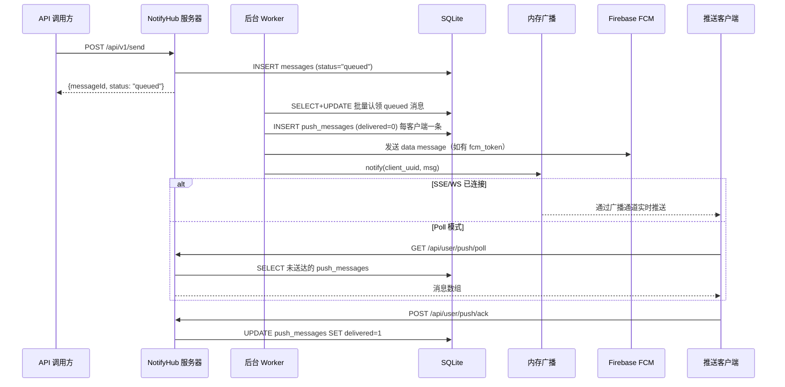
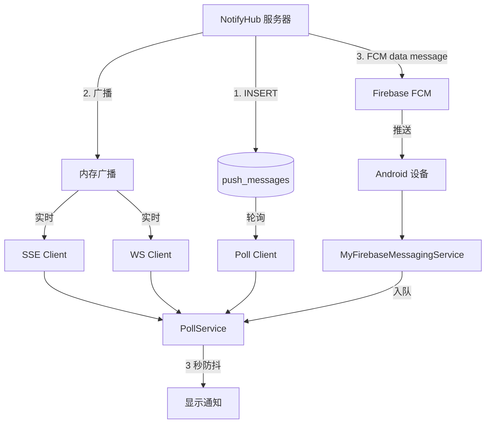

# 推送通道

与依赖外部服务商的邮件和短信不同，推送通道由 NotifyHub 服务器直接向已连接的客户端投递消息。本文档涵盖从 API 调用到客户端通知的完整消息生命周期、三种连接模式（SSE / WebSocket / Poll）、Android 端 FCM 集成，以及异常处理与重连策略。

## 端到端消息流程



### 阶段一：消息接收

`POST /api/v1/send` 接收消息负载并立即返回：

1. **认证**：DualAuth — 支持 JWT 或 API Key（`nh_...` 前缀）。
2. **幂等性**：若提供了 `idempotencyKey` 且已存在，返回已有消息。
3. **模板渲染**：若设置了 `template`，渲染 `{{var}}` / `{{var | default:"value"}}` 占位符。
4. **通道解析**：查找请求类型的默认启用通道。
5. **定时投递**：`scheduledAt`（时间戳）或 `delay`（相对值：`30m`、`1h`、`1d`、`1w`）可延迟投递。
6. **写入数据库**：插入 `messages` 表，`status = "queued"`。

接口返回 `{ messageId, status: "queued" }` — 投递是**异步**的。

### 阶段二：Worker 处理

后台 Worker 在无限循环中运行：

1. **批量认领**：通过 `UPDATE ... RETURNING` 原子性地认领 N 条 `status = 'queued'`（或 `'failed'` 且仍有重试次数）的消息，按 `priority DESC, created_at ASC` 排序。
2. **通道分发**：按 `ChannelType` 路由：
   - **邮件** → 通过 lettre 发送 SMTP
   - **短信** → Twilio / 阿里云 / 腾讯云 API
   - **推送** → 立即返回成功（投递单独处理）
3. **推送投递**（`create_push_messages`）：
   - 若 `to` 为 `"*"` 或空 → 广播给用户的**所有**客户端
   - 否则 → 投递给指定的客户端 UUID
   - 对每个目标客户端：
     - 插入一条 `push_messages` 记录（`delivered = 0`）
     - 发送 FCM data message（若客户端有 `fcm_token` 且已配置 FCM）
     - 调用 `push_state.notify(uuid, msg)` 唤醒 SSE/WS 订阅者

### 阶段三：客户端消费

消息通过三条并行路径到达客户端：

| 路径 | 机制 | 延迟 | 持久性 |
|------|------|------|--------|
| **SSE / WebSocket** | 通过内存广播实时推送 | 即时 | 无订阅者时丢失 |
| **Poll** | 客户端查询 `push_messages` 表 | 轮询间隔（默认 5s） | 持久 — 断连不丢失 |
| **FCM**（Android） | Firebase 推送到设备 | 近即时 | 由 FCM 基础设施保障 |

:::tip 双重投递保障
SSE/WS 消息同时也持久化到 `push_messages` 表。客户端断连后重连时，会在连接建立时先接收所有未送达消息，再进入实时流。因此即使临时断连也不会丢失消息。
:::

### 阶段四：ACK 与清理

客户端消费消息后通过 `POST /api/user/push/ack` 确认：

1. 将 `push_messages` 行标记为 `delivered = 1`。
2. 检查该源消息的**所有** `push_messages` 是否都已送达。
3. 若全部送达：
   - **无保留策略**（`messageExpiryDays = -1`）：删除 `push_messages` 和源 `messages` 记录。
   - **有保留策略**：更新源 `messages` 状态为 `"delivered"`。

Poll 模式在拉取时**自动 ACK**（无需显式调用）。SSE/WS 客户端必须显式 ACK。

---

## 连接模式

### SSE（Server-Sent Events）

```
GET /api/user/push/stream?uuid={uuid}
Authorization: Bearer {jwt}
```

**工作原理：**
- 服务器先发送 `connected` 事件，然后流式推送 `data: {"data": [...]}` 事件。
- 连接时先刷新所有未送达消息，再进入实时流。
- 服务器每 **30 秒**发送 SSE 注释行（`:` 开头）作为心跳。
- 客户端逐行读取字节流，解析 `data: ` 前缀的行。

**客户端超时**：90 秒读取超时（心跳间隔的 3 倍）。若 90 秒内无数据，视为连接过期并重连。

**认证说明**：SSE 连接通过查询参数传递 JWT（`?token=`），因为部分 HTTP 客户端无法在 EventSource 连接上设置自定义 Header。

### WebSocket

```
GET /api/user/push/ws?uuid={uuid}&token={jwt}
(Connection: Upgrade)
```

**工作原理：**
- 通过标准握手将 HTTP 升级为 WebSocket。
- 服务器先发送 `{"event":"connected","data":{"connected":true}}` 文本帧。
- 刷新未送达消息后，实时消息以 `{"data": [msg]}` 文本帧到达。
- 服务器每 30 秒发送 **Ping** 帧，客户端需回复 **Pong**。
- 客户端发起的 **Close** 会被优雅处理。

**认证说明**：JWT 通过 WebSocket URL 的 `?token=` 查询参数传递，因为大多数客户端库的 WS 握手不支持自定义 `Authorization` Header。

### Poll（轮询）

```
GET /api/user/push/poll?uuid={uuid}&limit=50
Authorization: Bearer {jwt}
```

**工作原理：**
- 客户端定期调用此接口（默认每 5 秒）。
- 服务器返回所有 `delivered = 0` 的 `push_messages`，最多 `limit` 条（最大 200）。
- 服务器**自动 ACK**所有返回的消息（标记 `delivered = 1`）。
- 无新消息时返回空数组 `[]`。

**适用场景：**
- 持久连接不可靠的环境（不稳定网络、移动设备省电）。
- 简单集成场景 — 无需 WebSocket/SSE 客户端库。
- CLI 工具和脚本。

### 模式对比

| 特性 | SSE | WebSocket | Poll |
|------|-----|-----------|------|
| 实时投递 | ✅ 即时 | ✅ 即时 | ⏱ 最多等一个轮询间隔 |
| 持久连接 | ✅ | ✅ | ❌ |
| 省电（移动端） | ⚠️ 一般 | ⚠️ 一般 | ✅ |
| 代理兼容性 | ✅ | ⚠️ 可能需要 WSS | ✅ |
| 自动 ACK | ❌ | ❌ | ✅ |
| 重连复杂度 | 低 | 低 | 无 |
| 每客户端服务端内存 | ~KB（广播槽） | ~KB（广播槽） | 无 |

---

## Android：FCM 与自建推送的关系

Android 端有**四种**投递机制。FCM 与三种自建模式是**互补**关系，而非替代。

### 架构图



### FCM 的定位

FCM 是**辅助唤醒通道**，不是 SSE/WS/Poll 的替代品：

1. **服务器并行发送 FCM data message**（非 notification message），同时写入 `push_messages` 和内存广播。
2. **纯数据消息**确保 Android 应用完全控制通知显示 — 不会出现 FCM 重复通知。
3. **可靠性兜底**：若 SSE/WS 连接静默断开（如网络切换、设备休眠），FCM 可以唤醒应用。

:::info FCM 配置后始终启用
FCM 投递与用户选择的自建模式（SSE/WS/Poll）**并行运行**，不是降级方案。客户端通过消息 ID 去重。
:::

### 自建模式选择

用户在 Android 设置中选择三种模式之一：

| 模式 | 实现类 | 传输方式 |
|------|--------|----------|
| SSE | `SseClient` | OkHttp EventSource |
| WebSocket | `WsClient` | OkHttp WebSocket |
| Poll | `PollService.startPollMode()` | HTTP GET 循环 |

**模式之间没有自动降级。** 若选定模式失败：
- 以**指数退避**重试同一模式：5s → 10s → 20s → 40s → 80s → 120s（上限）。
- HTTP 401（认证失败）：用存储的凭据重新登录、重新注册、重启。
- 模式切换是**显式的** — 用户必须在设置中手动选择其他模式。

### 消息去重

同一条消息可能通过 FCM **和** SSE/WS/Poll 同时到达：

1. 所有收到的消息都按消息 ID 去重后保存到 `MessageStore`。
2. `handleIncomingMessages()` 在显示通知前检查是否重复。
3. 所有消息（包括重复的）都会发送 ACK，确保服务端正确清理。

### 通知防抖

为防止重连时通知风暴（积压的未送达消息批量刷新）：

1. 消息累积到 `pendingMessages` 队列。
2. 每条新消息重置 **3 秒防抖计时器**。
3. 3 秒静默后：
   - **≤ 5 条**：逐条显示通知。
   - **> 5 条**：显示批量摘要通知 + 最后 3 条单独显示。

---

## Desktop / Tauri

桌面端支持 SSE、WebSocket 和 Poll，架构与 Android 相同：

- **模式选择**：通过 UI 显式切换，存储在 `config.toml`。
- **无自动降级**：每个模式以指数退避（5s 到 120s）自行重试。
- **JWT 刷新**：收到 401 时调用 `try_refresh_jwt()`，用存储的凭据重新登录并注册。
- **通知防抖**：与 Android 相同的 3 秒静默窗口。

### 图片自动下载

桌面端和 Android 端都会自动下载图片附件（最大 5MB）。图片缓存到本地并在通知中显示。

---

## CLI

CLI 通过命令行标志支持三种模式：

```bash
notify listen --sse    # SSE 模式
notify listen --ws     # WebSocket 模式
notify listen --poll   # Poll 模式（默认）
```

**与 Desktop/Android 的区别：**
- 收到 401 认证错误时，CLI 打印错误并**退出**（不自动重新登录）。
- 消息输出到 stdout，可选写入 JSONL 文件。
- 无通知防抖 — 消息即时显示。

---

## 异常处理

### 连接异常

| 异常 | SSE/WS 行为 | Poll 行为 |
|------|-------------|-----------|
| 网络超时 | 退避重连 | 下次轮询重试 |
| HTTP 401（JWT 过期） | 重新登录 → 重新注册 → 重启 | 重新登录 → 重新注册 → 重启 |
| HTTP 403 | 尝试重新登录 | 尝试重新登录 |
| HTTP 5xx | 退避重连 | 下次轮询重试 |
| WebSocket 关闭 | 退避重连 | N/A |
| SSE 流结束 | 退避重连 | N/A |

### 指数退避

所有客户端使用相同的退避策略：

```
第 1 次： 5 秒
第 2 次：10 秒
第 3 次：20 秒
第 4 次：40 秒
第 5 次：80 秒
第 6 次+：120 秒（上限）
```

连接成功后退避**重置**。

### ACK 重试

ACK 调用最多重试 **3 次**，间隔 1 秒。ACK 失败不会导致当前连接上的消息重投递，但消息在数据库中仍为 `delivered = 0` — 因此下次 SSE/WS 连接或 Poll 时会被重新投递。

### 广播滞后

内存广播通道每客户端有 64 个槽位的缓冲区。若客户端落后（如网络慢），`Lagged` 错误会被静默跳过。丢失的消息仍在 `push_messages` 中，会在下次连接刷新或 Poll 时投递。

---

## 服务端推送状态

### 内存广播

`PushState` 是 `Arc<RwLock<>>` 保护的 `HashMap<String, broadcast::Sender<Value>>`：

- 每个客户端 UUID 拥有 `broadcast::channel(64)` — 64 个槽位用于突发处理。
- `subscribe(uuid)`：获取或创建广播通道，返回 `Receiver`。
- `notify(uuid, msg)`：通过广播发送。若无订阅者，消息从广播中静默丢弃（但持久化在数据库中）。
- **过期清理**：每 300 秒运行一次，移除零接收者的通道。

### 数据库表

**`push_messages`** — Poll 投递的持久化消息队列：

| 字段 | 类型 | 说明 |
|------|------|------|
| `id` | TEXT | UUID 主键 |
| `user_id` | INTEGER | 所属用户 |
| `client_uuid` | TEXT | 目标客户端 |
| `source_message_id` | TEXT | 原始消息 ID |
| `title` | TEXT | 通知标题 |
| `body` | TEXT | 通知内容 |
| `level` | TEXT | 消息级别 |
| `delivered` | INTEGER | 0 = 待投递，1 = 已送达 |
| `created_at` | TEXT | 创建时间 |

**`push_clients`** — 已注册的客户端设备：

| 字段 | 类型 | 说明 |
|------|------|------|
| `uuid` | TEXT | 客户端 UUID（主标识） |
| `user_id` | INTEGER | 所属用户 |
| `name` | TEXT | 设备名称 |
| `os` | TEXT | 操作系统 |
| `arch` | TEXT | CPU 架构 |
| `desktop` | TEXT | 平台（android/desktop/cli） |
| `app_version` | TEXT | 客户端版本 |
| `fcm_token` | TEXT | Firebase 注册令牌 |
| `connection_mode` | TEXT | 最后使用的模式（sse/ws/poll） |
| `last_seen_at` | TEXT | 最后活动时间 |
