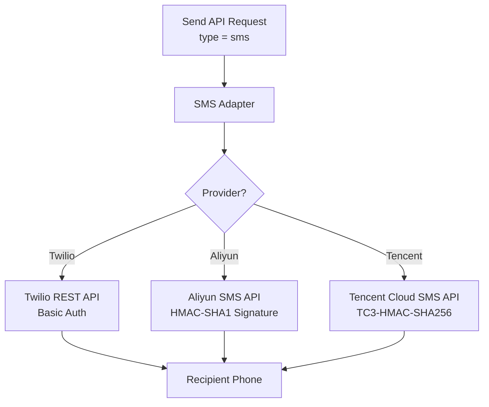
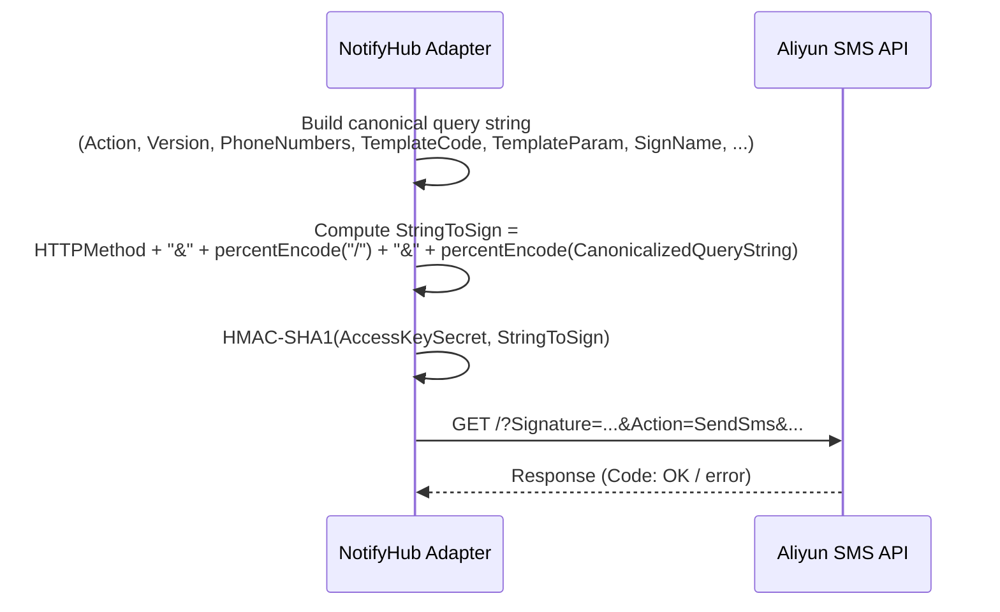
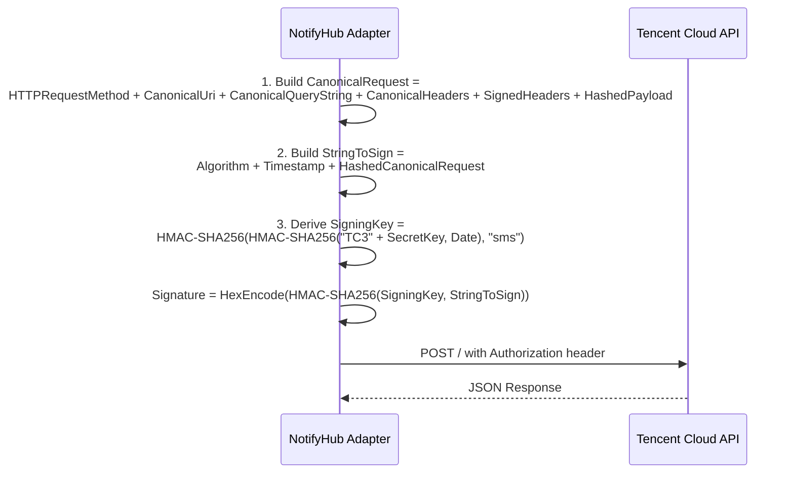

# 短信渠道

NotifyHub 支持三种短信服务商，每种都通过统一的适配器接口访问。所有短信服务商都使用**基于模板**的模式：消息主题指定模板代码，消息正文以 JSON 字符串携带模板参数。

## 概览



## 短信发送原理

与邮件不同，短信投递需要在服务商端进行**模板预审批**。NotifyHub 的消息字段映射如下：

| API 字段 | 映射到 | 说明 |
|-----------|---------|-------------|
| `subject` | 模板代码 | 服务商的模板 ID 或代码（如 `SMS_123456`）。 |
| `body` | 模板参数 | 用于替换模板变量的键值对 JSON 字符串。 |
| `to` | 手机号码 | E.164 格式的收件人手机号码（如 `+1234567890`）。 |

发送请求示例：

```json
{
  "type": "sms",
  "to": "+1234567890",
  "subject": "SMS_123456",
  "body": "{\"code\": \"4392\", \"expire\": \"5\"}"
}
```

这将发送模板 `SMS_123456`，其中 `{code}` 替换为 `4392`，`{expire}` 替换为 `5`。

:::note
Twilio 更加灵活，不严格要求模板 -- 你可以将 `subject` 留空，将消息内容放在 `body` 中来发送自由格式文本。但阿里云和腾讯云强制要求模板注册。
:::

---

## Twilio

Twilio 提供通过 REST API 访问的全球短信网关，使用 HTTP Basic 认证。

### 配置字段

| 字段 | 类型 | 是否必填 | 说明 | 示例 |
|-------|------|----------|-------------|---------|
| `accountSid` | string | 是 | 你的 Twilio Account SID。可在 Twilio 控制台首页找到。 | `ACxxxxxxxxxxxxxxxxxxxxxxxxxxxxxxxx` |
| `authToken` | string | 是 | 你的 Twilio Auth Token。与 Account SID 在同一页面找到。 | `your_auth_token` |
| `fromNumber` | string | 是 | 用于发送的 Twilio 手机号码或消息服务 SID。必须为 E.164 格式。 | `+15005550006` |

### 配置步骤

1. 在 [twilio.com](https://www.twilio.com) 注册并购买支持短信的手机号码。
2. 从 [Twilio 控制台](https://console.twilio.com) 获取你的 **Account SID** 和 **Auth Token**。
3. 创建渠道：

```bash
curl -X POST http://localhost:3000/api/admin/channels \
  -H "Authorization: Bearer <ADMIN_TOKEN>" \
  -H "Content-Type: application/json" \
  -d '{
    "type": "sms",
    "name": "Twilio SMS",
    "config": {
      "provider": "twilio",
      "accountSid": "ACxxxxxxxxxxxxxxxxxxxxxxxxxxxxxxxx",
      "authToken": "your_auth_token",
      "fromNumber": "+15005550006"
    }
  }'
```

4. 测试连接：

```bash
curl -X POST http://localhost:3000/api/admin/channels/{channelId}/test \
  -H "Authorization: Bearer <ADMIN_TOKEN>"
```

### 通过 Twilio 发送

```bash
curl -X POST http://localhost:3000/api/send \
  -H "Authorization: Bearer <APP_TOKEN>" \
  -H "Content-Type: application/json" \
  -d '{
    "type": "sms",
    "to": "+14155551234",
    "body": "Your verification code is 847291."
  }'
```

Twilio 也支持基于模板的发送：

```json
{
  "type": "sms",
  "to": "+14155551234",
  "subject": "HXxxxxxxxxxxxxxxxxxxxxxxxxxxxxxxxx",
  "body": "{\"code\": \"847291\"}"
}
```

---

## 阿里云短信

阿里云短信使用 HMAC-SHA1 签名请求。所有消息必须使用在[阿里云短信控制台](https://dysms.console.aliyun.com)中预审批的模板。

### 配置字段

| 字段 | 类型 | 是否必填 | 说明 | 示例 |
|-------|------|----------|-------------|---------|
| `accessKeyId` | string | 是 | 阿里云 AccessKey ID。 | `LTAI5tPxFcvNkWn5mGJqPz` |
| `accessKeySecret` | string | 是 | 阿里云 AccessKey Secret。用于通过 HMAC-SHA1 对请求签名。 | `your_access_key_secret` |
| `signName` | string | 是 | 已审批的短信签名，显示为发件人名称。 | `NotifyHub` |
| `endpoint` | string | 否 | API 端点 URL。默认为阿里云短信公网端点。 | `https://dysmsapi.aliyuncs.com` |

### 签名机制

阿里云要求每个 API 请求携带通过规范化查询字符串计算的 HMAC-SHA1 签名。NotifyHub 会自动处理：



### 配置步骤

1. 登录[阿里云控制台](https://home.console.aliyun.com)，在 RAM 中创建 AccessKey 对。
2. 在[短信服务控制台](https://dysms.console.aliyun.com)中注册短信模板和签名。记录模板代码（如 `SMS_123456`）。
3. 创建渠道：

```bash
curl -X POST http://localhost:3000/api/admin/channels \
  -H "Authorization: Bearer <ADMIN_TOKEN>" \
  -H "Content-Type: application/json" \
  -d '{
    "type": "sms",
    "name": "Aliyun SMS",
    "config": {
      "provider": "aliyun",
      "accessKeyId": "LTAI5tPxFcvNkWn5mGJqPz",
      "accessKeySecret": "your_access_key_secret",
      "signName": "NotifyHub",
      "endpoint": "https://dysmsapi.aliyuncs.com"
    }
  }'
```

4. 测试连接：

```bash
curl -X POST http://localhost:3000/api/admin/channels/{channelId}/test \
  -H "Authorization: Bearer <ADMIN_TOKEN>"
```

### 通过阿里云发送

```bash
curl -X POST http://localhost:3000/api/send \
  -H "Authorization: Bearer <APP_TOKEN>" \
  -H "Content-Type: application/json" \
  -d '{
    "type": "sms",
    "to": "+8613800138000",
    "subject": "SMS_123456",
    "body": "{\"code\": \"4392\", \"expire\": \"5\"}"
  }'
```

此示例中，`SMS_123456` 是阿里云模板代码。模板内容可能为：`Your verification code is ${code}, valid for ${expire} minutes.`

---

## 腾讯云短信

腾讯云短信使用 TC3-HMAC-SHA256 签名方案。与阿里云一样，需要预注册模板。

### 配置字段

| 字段 | 类型 | 是否必填 | 说明 | 示例 |
|-------|------|----------|-------------|---------|
| `secretId` | string | 是 | 腾讯云 Secret ID。 | `your_secret_id` |
| `secretKey` | string | 是 | 腾讯云 Secret Key。用于计算 TC3-HMAC-SHA256 签名。 | `your_secret_key` |
| `signName` | string | 是 | 已审批的短信签名。 | `NotifyHub` |
| `sdkAppId` | string | 是 | 在腾讯云控制台创建的短信应用 ID。 | `1400000000` |
| `endpoint` | string | 否 | API 端点。默认为腾讯云短信公网端点。 | `https://sms.tencentcloudapi.com` |

### 签名机制（TC3-HMAC-SHA256）

腾讯云使用三步签名流程：



### 配置步骤

1. 登录[腾讯云控制台](https://console.cloud.tencent.com)，在 CAM 中创建 SecretId/SecretKey 对。
2. 在[短信控制台](https://console.cloud.tencent.com/smsv2)中创建短信应用并注册模板和签名。记录 `SdkAppId` 和模板 ID。
3. 创建渠道：

```bash
curl -X POST http://localhost:3000/api/admin/channels \
  -H "Authorization: Bearer <ADMIN_TOKEN>" \
  -H "Content-Type: application/json" \
  -d '{
    "type": "sms",
    "name": "Tencent Cloud SMS",
    "config": {
      "provider": "tencent",
      "secretId": "your_secret_id",
      "secretKey": "your_secret_key",
      "signName": "NotifyHub",
      "sdkAppId": "1400000000",
      "endpoint": "https://sms.tencentcloudapi.com"
    }
  }'
```

4. 测试连接：

```bash
curl -X POST http://localhost:3000/api/admin/channels/{channelId}/test \
  -H "Authorization: Bearer <ADMIN_TOKEN>"
```

### 通过腾讯云发送

```bash
curl -X POST http://localhost:3000/api/send \
  -H "Authorization: Bearer <APP_TOKEN>" \
  -H "Content-Type: application/json" \
  -d '{
    "type": "sms",
    "to": "+8613800138000",
    "subject": "123456",
    "body": "{\"code\": \"4392\"}"
  }'
```

此处 `123456` 是腾讯云模板 ID。`body` 包含用于替换的参数。

---

## 服务商对比

| 特性 | Twilio | 阿里云短信 | 腾讯云短信 |
|---------|--------|------------|-------------------|
| **认证方式** | HTTP Basic Auth (SID + Token) | HMAC-SHA1 签名 | TC3-HMAC-SHA256 签名 |
| **是否需要模板** | 可选（支持自由格式） | 是（强制要求） | 是（强制要求） |
| **全球覆盖** | 180+ 个国家/地区 | 中国 + 部分国际地区 | 中国 + 部分国际地区 |
| **发送方 ID 格式** | E.164 手机号码或消息服务 SID | 已审批的签名 | 已审批的签名 |
| **签名复杂度** | 无（Basic Auth） | 中等（HMAC-SHA1） | 较高（三步 HMAC-SHA256） |
| **适用场景** | 全球/国际短信 | 中国大陆、阿里云用户 | 中国大陆、腾讯云用户 |
| **配置字段数** | 3 | 4 | 5 |

:::tip
如果你的目标用户在中国大陆，由于监管合规和本地运营商协议，阿里云或腾讯云通常是更好的选择。对于全球覆盖，Twilio 是最直接的选择。
:::

## 通过 API 发送短信

三种服务商使用相同的发送 API 接口。唯一的区别是你指向的 `channelId`（或哪个服务商被设为默认）。

### 最简请求（Twilio 自由格式）

```bash
curl -X POST http://localhost:3000/api/send \
  -H "Authorization: Bearer <APP_TOKEN>" \
  -H "Content-Type: application/json" \
  -d '{
    "type": "sms",
    "to": "+14155551234",
    "body": "Hello from NotifyHub!"
  }'
```

### 基于模板的请求（阿里云 / 腾讯云）

```bash
curl -X POST http://localhost:3000/api/send \
  -H "Authorization: Bearer <APP_TOKEN>" \
  -H "Content-Type: application/json" \
  -d '{
    "type": "sms",
    "channelId": "channel-uuid-here",
    "to": "+8613800138000",
    "subject": "SMS_123456",
    "body": "{\"code\": \"4392\", \"expire\": \"5\"}"
  }'
```

### 发送给多个收件人

```bash
curl -X POST http://localhost:3000/api/send \
  -H "Authorization: Bearer <APP_TOKEN>" \
  -H "Content-Type: application/json" \
  -d '{
    "type": "sms",
    "to": ["+14155551234", "+14155555678"],
    "subject": "SMS_123456",
    "body": "{\"code\": \"4392\"}"
  }'
```

成功响应：

```json
{
  "success": true,
  "messageId": "f3e2d1c0-b9a8-7654-3210-fedcba987654",
  "channelId": "a1b2c3d4-e5f6-7890-abcd-ef1234567890",
  "accepted": ["+14155551234", "+14155555678"]
}
```

:::warning
短信服务商会执行速率限制和每日配额。请监控你的服务商控制台以避免触发上限。NotifyHub 默认不限制出站短信。
:::
