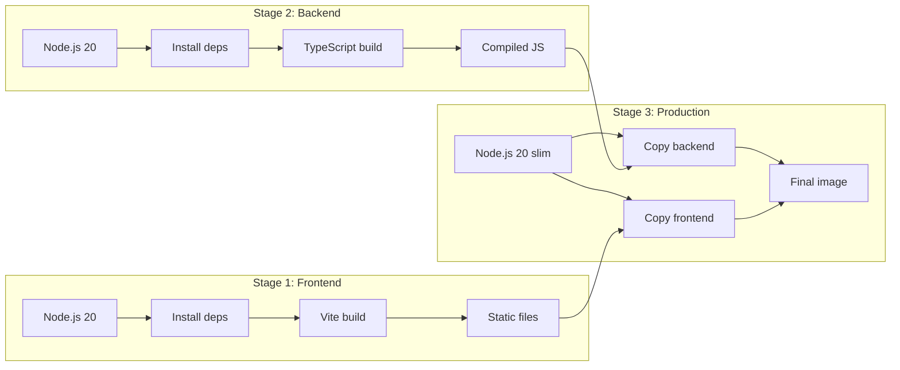

# Docker 部署

运行 NotifyHub 最快的方式是使用 Docker。只需一条 `docker compose up` 命令即可启动完整的服务栈。

## 快速开始

```bash
# Clone the repository
git clone https://github.com/notifyhub/notifyhub.git
cd notifyhub

# Create your environment file
cp .env.example .env
# Edit .env with your settings (see Environment Variables below)

# Start the stack
docker compose -f deploy/docker-compose.yml up -d

# Check it's running
curl http://localhost:9527/health
```

服务将在 `http://localhost:9527` 可用。使用 `.env` 中的管理员凭据登录。

## Dockerfile 说明

Dockerfile 使用**多阶段构建**来保持生产镜像的小体积。



| 阶段 | 功能 | 基础镜像 |
|---|---|---|
| `frontend` | 安装依赖，运行 `vite build` 生成静态资源 | `node:20-alpine` |
| `backend` | 安装依赖，运行 `tsc` 编译 JS | `node:20-alpine` |
| `production` | 将编译后的 JS 和静态文件复制到精简运行时 | `node:20-slim` |

开发依赖（TypeScript、Vite 等）**不会**包含在最终镜像中。

## docker-compose.yml

```yaml
services:
  notifyhub:
    build:
      context: ..
      dockerfile: deploy/Dockerfile
    container_name: notifyhub
    restart: unless-stopped
    ports:
      - "9527:9527"
    env_file:
      - ../.env
    volumes:
      - notifyhub-data:/app/data

volumes:
  notifyhub-data:
    driver: local
```

## 环境变量

在项目根目录创建 `.env` 文件：

```bash
# Server
PORT=9527
HOST=0.0.0.0

# Database (path inside the container)
DATABASE_URL=./data/notify-hub.db

# Admin account (created on first run)
ADMIN_EMAIL=admin@notifyhub.local
ADMIN_USERNAME=admin
ADMIN_PASSWORD=change-me-to-a-strong-password

# Security (auto-generated if not set, but set for persistence)
JWT_SECRET=your-random-64-char-string
ENCRYPTION_KEY=your-random-32-char-string

# CORS
CORS_ORIGIN=*
```

| 变量 | 必填 | 默认值 | 说明 |
|---|---|---|---|
| `PORT` | 否 | `9527` | 服务器监听端口 |
| `HOST` | 否 | `0.0.0.0` | 绑定地址 |
| `DATABASE_URL` | 否 | `./data/notify-hub.db` | SQLite 文件路径 |
| `ADMIN_EMAIL` | 否 | `admin@notifyhub.local` | 初始管理员邮箱 |
| `ADMIN_USERNAME` | 否 | `admin` | 初始管理员用户名 |
| `ADMIN_PASSWORD` | 否 | `admin123` | 初始管理员密码 |
| `JWT_SECRET` | 否 | 自动生成 | 用于签名 JWT 的密钥 |
| `ENCRYPTION_KEY` | 否 | 自动生成 | 用于加密凭据的密钥 |
| `CORS_ORIGIN` | 否 | `*` | 允许的 CORS 来源 |

:::warning
部署到生产环境前，请修改 `ADMIN_PASSWORD`、`JWT_SECRET` 和 `ENCRYPTION_KEY`。
:::

## 卷挂载

`notifyhub-data` 卷映射到容器内的 `/app/data` 目录，SQLite 数据库存放于此。

```yaml
volumes:
  - notifyhub-data:/app/data
```

### 备份

```bash
# Copy the database out of the container
docker cp notifyhub:/app/data/notify-hub.db ./backup-$(date +%Y%m%d).db
```

### 绑定挂载替代方案

```yaml
volumes:
  - ./data:/app/data
```

## 反向代理 SSL/TLS

在生产环境中，建议在前端放置 nginx 来终止 TLS。

```nginx
server {
    listen 443 ssl http2;
    server_name notifyhub.yourdomain.com;

    ssl_certificate /etc/letsencrypt/live/notifyhub.yourdomain.com/fullchain.pem;
    ssl_certificate_key /etc/letsencrypt/live/notifyhub.yourdomain.com/privkey.pem;

    add_header Strict-Transport-Security "max-age=63072000" always;

    location / {
        proxy_pass http://127.0.0.1:9527;
        proxy_set_header Host $host;
        proxy_set_header X-Real-IP $remote_addr;
        proxy_set_header X-Forwarded-For $proxy_add_x_forwarded_for;
        proxy_set_header X-Forwarded-Proto $scheme;
    }
}
```

## 健康检查

```http
GET /health
```

返回 `200 OK`，响应体为 `{ "status": "ok" }`。

## 更新

```bash
cd notifyhub
git pull origin main
docker compose -f deploy/docker-compose.yml down
docker compose -f deploy/docker-compose.yml up -d --build
```

数据库存放在卷中，升级后数据会保留。

:::tip
升级前请先备份：
```bash
docker cp notifyhub:/app/data/notify-hub.db ./pre-upgrade-backup.db
```
:::

## 故障排除

| 问题 | 检查方法 |
|---|---|
| 容器立即退出 | `docker compose logs notifyhub` |
| 无法连接 | `docker compose ps`，检查端口映射 |
| 数据库被锁定 | 确保只有一个容器在运行 |
| 缺少环境变量 | 检查 `.env` 文件是否存在且包含所有必需的值 |
