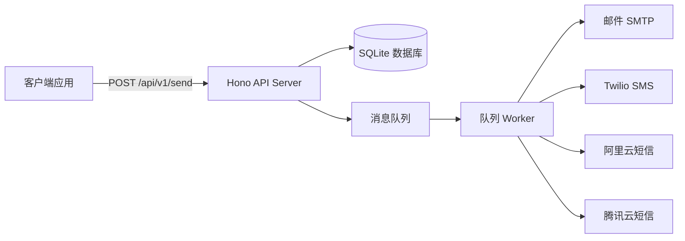

# NotifyHub 文档

**NotifyHub** 是一套自托管的通知推送服务。部署在自己的 VPS 上，配置 SMTP/SMS 凭证，生成 API Key，通过统一的 API 发送邮件、短信等通知。

## 核心特性

- **多渠道** — 邮件 (SMTP)、短信 (Twilio / 阿里云 / 腾讯云)
- **模板引擎** — `{{变量}}` 插值，支持默认值，按渠道类型分模板
- **消息队列** — SQLite 原子队列，指数退避重试，死信队列
- **安全** — AES-256-GCM 加密存储凭证，bcrypt 密码哈希，JWT 认证
- **多用户** — 管理员 / 普通用户角色，基于邮箱注册登录
- **API Key** — 按用户隔离，支持作用域、速率限制、IP 白名单
- **自托管** — Docker 一键部署，数据完全在自己服务器上

## 系统架构

## 技术栈

| 层 | 技术 |
|---|---|
| API 服务器 | Hono + @hono/node-server |
| 数据库 | SQLite (better-sqlite3) + Drizzle ORM |
| 前端 | React 18 + Vite + Tailwind CSS + shadcn/ui |
| CLI | Commander.js |
| 认证 | JWT (jsonwebtoken) + bcryptjs |
| 加密 | AES-256-GCM (Node.js crypto) |
| 邮件 | Nodemailer |
| 短信 | Twilio / 阿里云 SDK / 腾讯云 SDK |
| 校验 | Zod |

## 快速导航

- [快速开始](/getting-started) — 安装、配置、第一次发送
- [系统架构](/architecture) — 组件图、数据模型、消息生命周期
- [渠道配置](/channels/overview) — 邮件和短信渠道设置
- [API 参考](/api/send) — 发送接口、消息查询、管理接口
- [模板](/templates) — 模板语法和使用示例
- [API 令牌](/tokens) — 令牌管理、作用域、速率限制
- [Docker 部署](/deployment/docker) — 容器化部署指南
- [VPS 部署](/deployment/vps) — 手动部署指南
