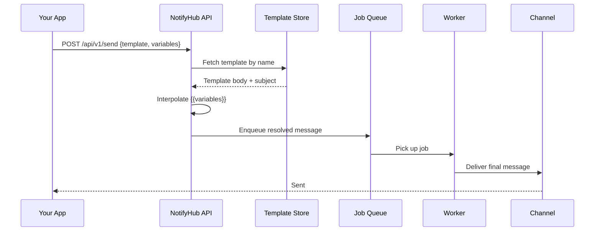

import MessageFlow from '@site/src/components/MessageFlow';

# 模板

模板让你定义可复用的消息正文，其中包含占位变量，在发送时进行填充。你只需创建一次模板，之后每次发送时传入不同的变量即可，无需硬编码每条通知。

## 模板工作原理



模板在**入队时**进行解析。Worker 接收到的是已经完成变量替换的消息。

- 变量值在你调用发送 API 时即被冻结。
- 发送后修改模板不会影响已在队列中的消息。
- 每种渠道类型（`email`、`sms`）都有各自独立的模板集。

## 模板语法

### 基本变量

用双花括号包裹变量名：

```text
Hello {{name}}, welcome to NotifyHub!
```

传入 `variables: { name: "Alice" }` 发送 → `Hello Alice, welcome to NotifyHub!`

### 默认值

当变量可能缺失时，提供一个回退值：

```text
Hello {{name | default:"there"}}, your code is {{code}}.
```

如果未提供 `name`，输出将变为：`Hello there, your code is 984321.`

### 语法规则

| 功能 | 语法 | 示例 |
|---|---|---|
| 简单变量 | `{{varName}}` | `{{order_id}}` |
| 带默认值 | `{{varName \| default:"fallback"}}` | `{{name \| default:"Customer"}}` |
| 允许的字符 | 字母、数字、下划线 | `{{user_name}}`、`{{code2}}` |
| 嵌套 | 不支持 | `{{outer {{inner}}}}` 不会生效 |

:::tip
变量名区分大小写。`{{Name}}` 和 `{{name}}` 是两个不同的变量。
:::

:::caution
模板在入队时解析一次。如果某个变量缺失且没有默认值，它将被替换为空字符串。
:::

## 创建模板

### 通过管理后台

1. 打开 NotifyHub 仪表盘。
2. 在侧边栏中导航到 **Templates**。
3. 点击 **New Template**。
4. 填写以下内容：
   - **Name** — 唯一标识符（例如 `order_shipped`）。
   - **Channel Type** — `email` 或 `sms`。
   - **Subject** —（仅限邮件）同样支持 `{{variable}}` 语法。
   - **Body** — 包含变量占位符的消息正文。
5. 点击 **Create**。

### 通过 API

```bash
curl -X POST http://localhost:9527/api/admin/templates \
  -H "Authorization: Bearer <your-jwt>" \
  -H "Content-Type: application/json" \
  -d '{
    "name": "order_confirmation",
    "channelType": "email",
    "subject": "Order {{order_id}} Confirmed",
    "body": "Hi {{name}},\n\nYour order {{order_id}} has been confirmed.\nTotal: {{total}}\n\nThank you!"
  }'
```

## 使用模板发送

在发送 API 调用中传入 `template` 名称和 `variables` 对象。

### curl

```bash
curl -X POST http://localhost:9527/api/v1/send \
  -H "Authorization: Bearer nh_your_token_here" \
  -H "Content-Type: application/json" \
  -d '{
    "channel": "email",
    "to": "customer@example.com",
    "template": "order_confirmation",
    "variables": {
      "name": "John",
      "order_id": "ORD-98765",
      "total": "$42.00"
    }
  }'
```

### JavaScript

```typescript
const response = await fetch("http://localhost:9527/api/v1/send", {
  method: "POST",
  headers: {
    Authorization: "Bearer nh_your_token_here",
    "Content-Type": "application/json",
  },
  body: JSON.stringify({
    channel: "email",
    to: "customer@example.com",
    template: "order_confirmation",
    variables: { name: "John", order_id: "ORD-98765", total: "$42.00" },
  }),
});
```

### Python

```python
import requests

resp = requests.post(
    "http://localhost:9527/api/v1/send",
    headers={"Authorization": "Bearer nh_your_token_here"},
    json={
        "channel": "email",
        "to": "customer@example.com",
        "template": "order_confirmation",
        "variables": {"name": "John", "order_id": "ORD-98765", "total": "$42.00"},
    },
)
```

## 按渠道模板

每个模板绑定单一渠道类型。请为每个渠道分别创建模板。

| 渠道 | 主题字段 | 正文限制 | 备注 |
|---|---|---|---|
| `email` | 是（支持变量） | 无硬性限制 | 支持 HTML |
| `sms` | 否 | 约 160 字符（GSM） | 请保持简短 |

## 示例

### 订单确认（邮件）

```text
Subject: Order {{order_id}} Confirmed

Hi {{name}},

Your order {{order_id}} has been confirmed.

Items: {{item_count}} item(s)
Total: {{total}}
Estimated delivery: {{delivery_date | default:"3-5 business days"}}

Track your order at {{tracking_url}}.
```

### OTP 验证（短信）

```text
Your {{app_name | default:"account"}} verification code is {{code}}. Expires in {{expiry | default:"10"}} minutes. Do not share this code.
```

## 内联模板

你也可以直接发送内联正文，无需创建已保存的模板：

```bash
curl -X POST http://localhost:9527/api/v1/send \
  -H "Authorization: Bearer nh_your_token_here" \
  -H "Content-Type: application/json" \
  -d '{
    "channel": "sms",
    "to": "+1234567890",
    "body": "Hello {{name}}, your order is on the way!",
    "variables": { "name": "John" }
  }'
```

内联正文支持相同的 `{{variable}}` 和 `{{var | default:"val"}}` 语法。

## 最佳实践

1. **清晰命名模板** — 使用如 `order-shipped-email` 或 `otp-sms` 这样的名称。
2. **始终为可选变量提供默认值**。
3. **保持短信模板简短** — 控制在 160 字符以内。
4. **使用真实数据测试**后再上线。
5. **修改模板**只会影响未来的发送；已在途的消息不受影响。
