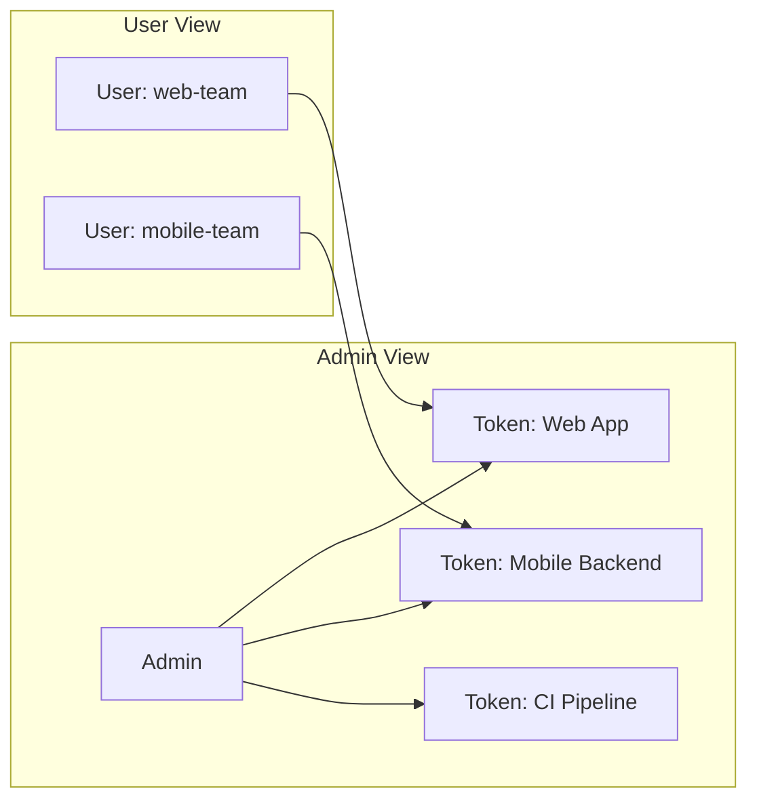

# API 令牌

每个对 NotifyHub 公共 API 的请求都需要一个 Bearer 令牌（bearer token）。令牌控制谁能发送通知、能使用哪些渠道以及发送速率。

## 令牌结构

```text
nh_a1b2c3d4e5f6g7h8i9j0k1l2m3n4o5p6
```

| 部分 | 说明 |
|---|---|
| `nh_` | 固定前缀，标识该令牌为 NotifyHub 令牌 |
| `a1b2c3...o5p6` | 32 位 nanoid 字符串（URL 安全，密码学随机生成） |

每个令牌携带以下元数据：

| 字段 | 类型 | 说明 |
|---|---|---|
| `id` | number | 令牌内部 ID |
| `name` | string | 人类可读的标签名称 |
| `token` | string | 完整的 Bearer 令牌（仅在创建时显示一次） |
| `scopes` | string[] | 该令牌可使用的渠道类型：`email`、`sms`、`push` |
| `rateLimit` | number | 每分钟最大请求数（滑动窗口） |
| `ipWhitelist` | string[] | 允许的来源 IP；为空表示不限制 |
| `enabled` | boolean | 令牌是否启用 |
| `userId` | number | 该令牌的所有者 |
| `lastUsedAt` | string \| null | 上次 API 调用的 ISO 时间戳 |

## 创建令牌

### 通过管理界面

1. 登录 NotifyHub 管理面板。
2. 在侧边栏中点击 **API Tokens**。
3. 点击 **Create Token**。
4. 配置名称、作用域和速率限制。
5. **立即复制令牌** -- 令牌仅显示一次。

### 通过 API

```bash
curl -X POST http://localhost:9527/api/admin/tokens \
  -H "Authorization: Bearer <your-jwt>" \
  -H "Content-Type: application/json" \
  -d '{
    "name": "Production Backend",
    "scopes": ["email", "sms"],
    "rateLimit": 120
  }'
```

响应：

```json
{
  "success": true,
  "data": {
    "id": 4,
    "name": "Production Backend",
    "token": "nh_x9y8z7w6v5u4t3s2r1q0p9o8n7m6l5k4",
    "scopes": ["email", "sms"],
    "rateLimit": 120
  }
}
```

:::warning
`token` 字段仅在创建时返回一次。请安全存储。如果遗失，请创建新令牌并撤销旧令牌。
:::

## 令牌作用域

作用域（scopes）控制令牌可以发送的渠道类型。

| 作用域 | 允许的渠道 |
|---|---|
| `email` | 仅邮件 |
| `sms` | 仅短信 |
| `push` | 仅推送通知 |

按需组合作用域：

```json
{ "scopes": ["email", "push"] }
```

如果请求尝试通过令牌作用域之外的渠道发送，API 将返回 `403 Forbidden`。

## 速率限制

每个令牌都有基于滑动窗口算法的每分钟速率限制。超出限制时，API 返回 `429 Too Many Requests` 并附带 `Retry-After` 头。

```text
Rate Limit: 60 requests/minute

00:00:00 - Request 1  ✅
00:00:01 - Request 2  ✅
...
00:00:59 - Request 60 ✅
00:01:00 - Request 61 ❌ 429 Too Many Requests
```

### 如何选择速率限制

| 使用场景 | 建议限制 |
|---|---|
| 单个后端服务 | 60-120 次/分钟 |
| CI/CD 流水线 | 30 次/分钟 |
| 高并发事务型 | 300+ 次/分钟 |
| 测试/开发环境 | 10-20 次/分钟 |

## IP 白名单

配置 IP 白名单后，API 仅接受来自指定 IP 的请求。其他 IP 将收到 `403 Forbidden`。

```json
{ "ipWhitelist": ["203.0.113.10", "198.51.100.5"] }
```

空数组表示不限制 IP。

:::tip
对于具有静态 IP 的生产环境后端服务，建议使用 IP 白名单。开发环境下可留空。
:::

## 按用户令牌隔离

令牌归属于创建它的用户：

- **普通用户** 仅能看到和管理自己的令牌。
- **管理员用户** 可以看到所有用户的令牌。



## 安全最佳实践

1. **绝不要在客户端代码中暴露令牌。** 请将令牌保存在后端。
2. **使用环境变量** 存储令牌。
3. **为每个服务创建独立的令牌**，以便于撤销。
4. **设置严格的速率限制** -- 从低值开始，按需增加。
5. **为生产环境令牌启用 IP 白名单。**
6. **定期轮换令牌。**
7. **监控 `lastUsedAt`**，留意异常活动。

## 在 API 请求中使用令牌

### curl

```bash
curl -X POST http://localhost:9527/api/v1/send \
  -H "Authorization: Bearer nh_your_token_here" \
  -H "Content-Type: application/json" \
  -d '{
    "channel": "email",
    "to": "user@example.com",
    "subject": "Hello",
    "body": "This is a test notification."
  }'
```

### JavaScript

```typescript
const NOTIFYHUB_TOKEN = process.env.NOTIFYHUB_TOKEN;

async function sendNotification(to: string, subject: string, body: string) {
  const response = await fetch("http://localhost:9527/api/v1/send", {
    method: "POST",
    headers: {
      Authorization: `Bearer ${NOTIFYHUB_TOKEN}`,
      "Content-Type": "application/json",
    },
    body: JSON.stringify({ channel: "email", to, subject, body }),
  });

  if (response.status === 429) {
    const retryAfter = response.headers.get("Retry-After");
    throw new Error(`Rate limited. Retry after ${retryAfter} seconds.`);
  }

  return response.json();
}
```

### Python

```python
import os, requests

NOTIFYHUB_TOKEN = os.environ["NOTIFYHUB_TOKEN"]

def send_notification(to: str, subject: str, body: str) -> dict:
    resp = requests.post(
        "http://localhost:9527/api/v1/send",
        headers={"Authorization": f"Bearer {NOTIFYHUB_TOKEN}"},
        json={"channel": "email", "to": to, "subject": subject, "body": body},
    )
    if resp.status_code == 429:
        raise Exception(f"Rate limited. Retry after {resp.headers.get('Retry-After')}s.")
    resp.raise_for_status()
    return resp.json()
```

## 管理令牌

| 操作 | 方法 | 端点 | 认证方式 |
|---|---|---|---|
| 列出令牌 | GET | `/api/admin/tokens` | JWT（管理员查看全部，普通用户查看自己的） |
| 创建令牌 | POST | `/api/admin/tokens` | JWT |
| 更新令牌 | PUT | `/api/admin/tokens/:id` | JWT（所有者或管理员） |
| 删除令牌 | DELETE | `/api/admin/tokens/:id` | JWT（所有者或管理员） |

已禁用的令牌（`enabled: false`）会拒绝所有请求并返回 `401 Unauthorized`。通过将 `enabled` 重新设置为 `true` 可重新启用。
